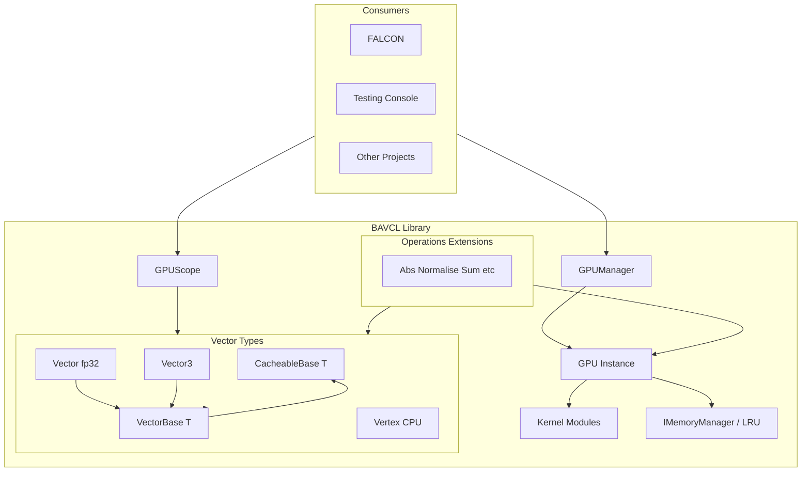
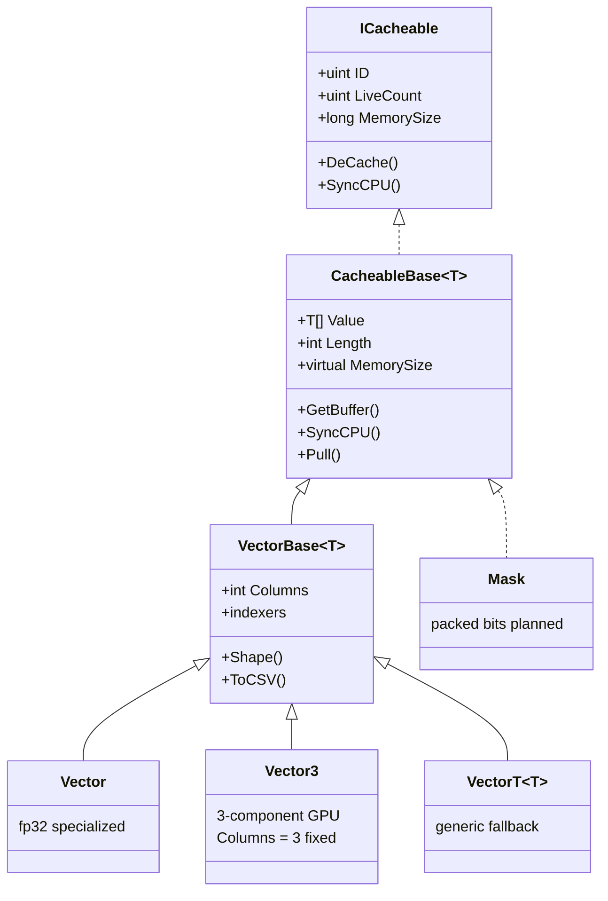
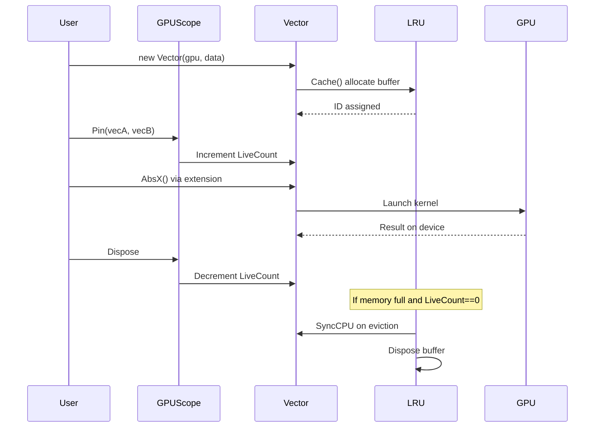
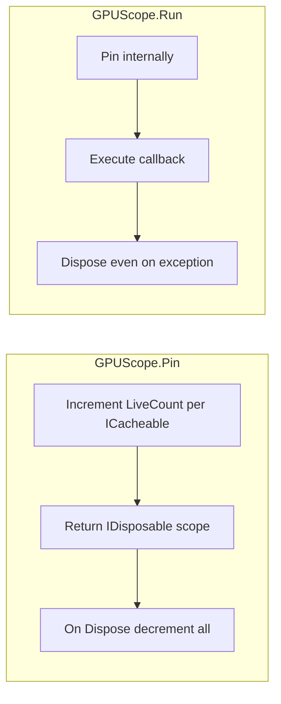
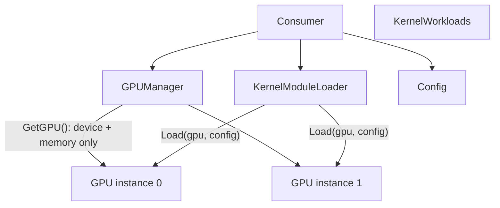
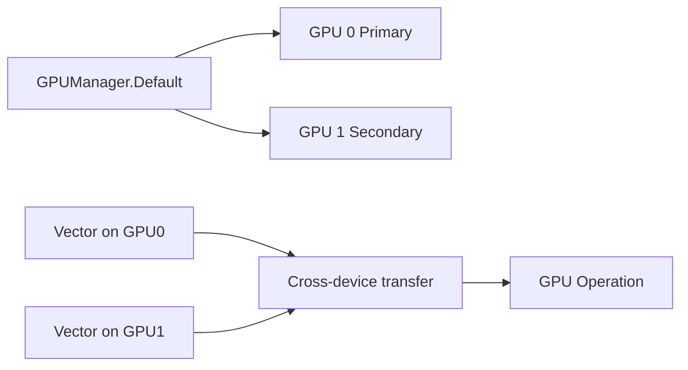

# BAVCL Specification

Authoritative reference for intended behavior. When code disagrees, this spec is the target.

**Version:** Discovery draft — July 2026
**Author:** Marcel Pawelczyk
**Status:** PROGRAM STILL IN DEVELOPMENT

Document Disclaimer: This document is intended for AI coding tools for reasoning and project alignment. While the contents may be beneficial for human use, the content may be verbose.

---

## Table of Contents

1. [Identity and Scope](#1-identity-and-scope)
2. [Design Principles](#2-design-principles)
3. [Architecture Overview](#3-architecture-overview)
4. [Current Functionality (v0)](#4-current-functionality-v0)
5. [Type System Roadmap](#5-type-system-roadmap)
6. [Mask Specification](#6-mask-specification)
7. [Kernel Module System](#7-kernel-module-system)
8. [GPU and Memory](#8-gpu-and-memory)
9. [Code Organization Roadmap](#9-code-organization-roadmap)
10. [CPU Execution Path](#10-cpu-execution-path)
11. [Geometry Module](#11-geometry-module)
12. [Astrophysics Module](#12-astrophysics-module)
13. [IO Module](#13-io-module)
14. [Plotting](#14-plotting)
15. [Experimental Math](#15-experimental-math)
16. [Testing and Quality](#16-testing-and-quality)
17. [Platform Support](#17-platform-support)
18. [Deferred / Nice-to-Have](#18-deferred--nice-to-have)
19. [Code vs Vision Gaps](#19-code-vs-vision-gaps)
20. [Related Projects](#20-related-projects)

---

## 1. Identity and Scope

### 1.1 What BAVCL Is

**BAVCL** is a **C# GPU-accelerated numerics library** built on [ILGPU](https://ilgpu.net/) 1.5.3. It provides NumPy-_inspired_ vector math with C#-idiomatic APIs — not a direct NumPy port.

| Attribute        | Value                                                  |
| ---------------- | ------------------------------------------------------ |
| Language         | C# (.NET 10)                                           |
| GPU runtime      | ILGPU 1.5.3 + ILGPU.Algorithms                         |
| Distribution     | Source-only project reference                          |
| License          | Source-available custom licence — see [License.txt](../License.txt) and [THIRD_PARTY_LICENSES.md](../THIRD_PARTY_LICENSES.md) |
| Primary consumer | **FALCON** (astrophysics application)                  |

### 1.2 Purpose

General-purpose GPU data-science / numerics for C# projects.

BAVCL accelerates large array operations on CUDA, OpenCL, or CPU backends while keeping smaller workloads on efficient CPU paths (SIMD). Actual backend implementation is dependant on ILGPU's implementation so this statement may not be correct.

### 1.3 Audience

- FALCON project (My Master's project)
- Personal, educational, academic, commercial, and research use per [License.txt](../License.txt) (attribution required for published research and commercial/professional use)

### 1.4 Solution Structure

```
BAVCL.sln
├── BAVCL/                  # Core library (net10.0)
└── Testing Console/        # Demo app + BenchmarkDotNet harness

BAVCL.Tests/                # Sibling repo — canonical test home
└── (separate solution at C:\Users\marce\Repos\BAVCL.Tests)
```

### 1.5 Out of Scope (v1) - Currently

- Matrix linear algebra (deferred)
- Table / dataframe structures (deferred)
- Public NuGet packaging

---

## 2. Design Principles

### 2.1 C#-Idiomatic API

Inspired by NumPy semantics but shaped for C# conventions: explicit types, properties, operator overloads, extension methods, and `IDisposable` patterns.

### 2.2 Specialized + Generic Types

- **Specialized types** where they add value: `Vector` (fp32), `Vector3`, future `VectorInt`, `Mask`, etc.
- **Generic `Vector<T>`** as fallback when no specialized type exists
- Rule: use specialized type when available; fall back to generic

### 2.3 CPU-Default / GPU-`X` Pattern

| Suffix   | Execution                      | When to use                      |
| -------- | ------------------------------ | -------------------------------- |
| _(none)_ | CPU (SIMD where implemented)   | Default; small arrays; debugging |
| `X`      | GPU-accelerated (ILGPU kernel) | Large arrays; requires`GPUScope` |

Examples: `Abs()` vs `AbsX()`, `Sum()` vs `SumX()` (planned), `Reverse()` vs `ReverseX()`.

### 2.4 Scope-Only GPU Pinning (IMPLEMENTED)

`LiveCount` is managed by `GpuScope.Begin()`. Individual operations use scopes internally; callers wrapping custom kernels should use:

```csharp
using (GpuScope.Begin(modified: output, readOnly: inputA, inputB))
{
    kernel(...);
    gpu.accelerator.Synchronize();
}
```

CPU edits: `CpuScope.Begin<T>(ICacheable<T>, bool syncToGpu)` or `.CpuScope()` / `.CpuScopeAndSync()`. Scope on `ICacheable`; `GetReadOnlySpan` / explicit `EditCpu` on `ICacheable<T>`. See [MigrationGuide.md](MigrationGuide.md).

### 2.5 Pluggable Memory Management

`IMemoryManager` interface allows alternative strategies. Default: LRU auto-cache with configurable memory cap (80% of device memory).

### 2.6 Extension-Method Organization (IMPLEMENTED)

Data types stay thin (`Vector.cs`, `Vector3.cs` — constructors, operators, copy/equals, conversions, indexers). Operations live in `Modules/` as **namespace feature gates**: import only the modules you need and the corresponding extensions appear on `Vector`, `Vector3`, and primitive arrays.

| Namespace | Public API file | Internal helpers |
|-----------|-----------------|------------------|
| `BAVCL.Modules.Arithmetic` | `VectorArithmeticExtensions.cs` | `Internal/SumCore.cs`, `Cross.cs`, `ElementWise.cs`, … |
| `BAVCL.Modules.Statistics` | `VectorStatisticsExtensions.cs` | `Internal/DescriptiveStatistics.cs`, `ArrayStatistics.cs`, … |
| `BAVCL.Modules.Structural` | `VectorStructuralExtensions.cs` | `Internal/Factories.cs`, `ShapeOps.cs`, `Formatting.cs` |
| `BAVCL.Modules.Geometric` | `Vector3GeometricExtensions.cs` | `Internal/Vector3Geometry.cs` |
| `BAVCL.Modules.GpuOps` | `GpuOpsModule.cs` | `Internal/Broadcast.cs`, `VectorGpuOps.cs`, `Vector3GpuOps.cs`, `VectorVectorOp.cs`, … |

Each module exposes **one API-catalog file** with C# 14 extension blocks. Static and instance members are split across paired public classes when required (CS0111), e.g. `VectorArithmetic` (static) + `VectorArithmeticExtensions` (instance + `*_IP`). Implementation lives in `Internal/` as `internal static` types — consumers never import or reference them.

```csharp
using BAVCL;                          // core Vector only

using BAVCL.Modules.Arithmetic;       // + Vector.Sum(v), v.Cross(b), …
using BAVCL.Modules.Statistics;       // + v.Mean(), arr.Min(), …

Vector.Sum(vec);   // NumPy-style static extension
vec.Sum();         // ndarray-style instance extension
```

`VectorBase<T>.Gpu` is `internal` to enable module access without public exposure.

### 2.7 Source-Only Distribution

Consumers reference the BAVCL project directly. No NuGet packaging planned YET.

---

## 3. Architecture Overview

### 3.1 High-Level Component Diagram



### 3.2 Type Hierarchy



**`CacheableBase<T>`** is the abstract base for **any GPU-cacheable data** (`BAVCL/Core/CacheableBase/CacheableBase.cs` — single file). It defines:

- GPU caching lifecycle (`Cache`, `DeCache`, `SyncCPU`, `GetBuffer`, `UpdateCache`)
- Coherence state (`ID`, `LiveCount`, `Residence`, `Length`)
- Host-side backing store (`Value[]`)
- `virtual MemorySize` — default `sizeof(T) × Length`; overridable for packed types (e.g. future `Mask`)
- Span/read APIs (`Pull`, `RetrieveReadOnlySpan`, `ToArray`, `CpuScope` host)

**`VectorBase<T>`** extends `CacheableBase<T>` with vector shape and indexing:

- Shape parameters (`Columns`, `RowCount`, `Shape()`)
- Indexers and coordinate access (`GetAt`, `SetAt`)
- `IIO` surface (`Print`, `ToCSV` forwarder to Structural module)

Operations (`Sum`, `Mean`, `Min`, `Max`, etc.) live in **`Modules/`** — not on the type hierarchy.

It is **not** a "CPU mirror" — `CacheableBase` owns memory; `VectorBase` owns vector semantics shared by all vector kinds.

### 3.3 GPU Lifecycle



### 3.4 GPUScope Flow



| API                                 | Use case                           |
| ----------------------------------- | ---------------------------------- |
| `GPUScope.Pin(params ICacheable[])` | Multi-statement GPU blocks         |
| `GPUScope.Run(cacheables, Func<T>)` | Single expressions; exception-safe |
| `GPUScope.Run(cacheables, Action)`  | Void GPU blocks                    |

Nested scopes are supported via `Interlocked` refcount on `LiveCount`.

### 3.5 Kernel Module Registration (IMPLEMENTED)



GPU creation and kernel loading are **separate steps**. Each `GPU` instance is configured independently via `KernelModuleLoader.Load<T>(gpu, domains)`. There is no implicit Core domain — if no modules are loaded, no kernels compile.

`GPUManager.Default` convenience: creates a GPU and loads `KernelWorkloads.Default` (fp32 Arithmetic + Structural).

### 3.6 Multi-GPU Data Flow (Target - WIP)



---

## 4. Current Functionality (v0)

This section documents **what exists in code today**. See [Section 19](#19-code-vs-vision-gaps) for divergences from the target design.

### 4.1 Entry Points

| Entry                       | Location                            | Role                                        |
| --------------------------- | ----------------------------------- | ------------------------------------------- |
| `GPUManager.Default`        | `BAVCL/Core/GPU/Services/GPUManager.cs` | Singleton lazy GPU + Default workload     |
| `GPUManager.GetGPU()`       | same                                | Create bare GPU (no kernels) with memory cap |
| `GPUManager.GetGPU<TMem>()` | same                                | GPU with custom `IMemoryManager`          |
| `KernelModuleLoader.Load<T>()` | `BAVCL/Core/GPU/KernelModules/`  | Compile selected domains for element type `T` onto a GPU |
| `KernelModuleLoader.LoadAll<T>()` | same                          | Compile every registered domain for `T`   |
| `KernelWorkloads.Default` / `.Geometry` | same                    | Named domain bundles                      |

### 4.2 Vector (float32)

**Type:** `BAVCL.Vector` — `sealed partial class : VectorBase<float>`
**Files:** 25 partial-class files under `BAVCL/Core/Vector/`

#### 4.2.1 Construction and Properties

| Method / Property                             | Description                                |
| --------------------------------------------- | ------------------------------------------ |
| `Vector(GPU, float[], columns=0, cache=true)` | Construct from array; `columns=0` row 1D (default), `1` column, `N>1` matrix |
| `Vector(GPU, int length, columns=0)`          | Uninitialized length (may contain garbage) |
| `Copy(cache=true)`                            | Deep copy                                  |
| `Equals(Vector)`                              | Element-wise equality after CPU sync       |
| `Shape()`                                     | `Shape` struct (`Rows`, `Cols`)            |
| `Flatten()`                                   | Set `Columns = 0` (1D row storage)         |
| `ToVector3()`                                 | Convert when length % 3 == 0               |

#### 4.2.2 Statistical Properties (CPU)

| Method           | Implementation                                             | Notes    |
| ---------------- | ---------------------------------------------------------- | -------- |
| `Sum()`          | CPU SIMD (`System.Numerics.Vector<float>`); Kahan for ≥10⁴ | Override |
| `Mean()`         | `Sum() / Length`                                           |          |
| `Var()`          | SIMD for small; GPU`differenceSquared` for large           |          |
| `Std()`          | `Sqrt(Var())`                                              |          |
| `Min()`, `Max()` | CPU after`SyncCPU()`                                       |          |
| `Range()`        | `Max - Min`                                                |          |

#### 4.2.3 Factory Methods

| Method                                       | Description          |
| -------------------------------------------- | -------------------- |
| `Zeros(gpu, length, columns)`                | Zero-filled vector   |
| `Ones(gpu, length, columns)`                 | Ones-filled          |
| `Fill(gpu, value, length, columns)`          | Constant fill        |
| `Arange(gpu, start, end, interval, columns)` | Range with step      |
| `Linspace(gpu, start, end, steps, columns)`  | Evenly spaced values |
| `Arange(...)` / `Linspace(...)` static       | Return`float[]` only |

#### 4.2.4 Element-wise and Unary Operations

| Operation  | CPU               | GPU (`X`)                 | In-place (`_IP`) |
| ---------- | ----------------- | ------------------------- | ---------------- |
| Abs        | `Abs`, `Abs_IP`   | `AbsX`, `AbsX_IP`         | yes              |
| Reciprocal | —                 | GPU kernel                | `Reciprocal_IP`  |
| Rsqrt      | CPU path          | `RsqrtX`, `RsqrtX_IP`     | yes              |
| Reverse    | —                 | `ReverseX`, `ReverseX_IP` | yes              |
| Diff       | `Diff`, `Diff_IP` | GPU kernel                | yes              |
| NanToNum   | —                 | `nanToNumKernel`          | `Nan_to_num_IP`  |
| Normalise  | CPU               | via divide                | `Normalise_IP`   |
| Log        | —                 | `LogKernel`               | `Log_IP`         |

#### 4.2.5 Binary Operations and Operators

**Migration:** See [`MigrationGuide.md`](MigrationGuide.md) for breaking changes to `Columns`, `OP`/`IPOP`, `ReduceOP`, and `Matrix*`.

Binary `+`, `-`, `*`, `/`, `^` operator overloads use **NumPy-style element-wise broadcast** via `OP()` / `IPOP()`. Three separate API families exist for different semantics:

| Family | Methods | Semantics |
| ------ | ------- | --------- |
| **Broadcast (default)** | `OP`, `IPOP`, operators | NumPy element-wise broadcast via `broadcastOpKernel` / `broadcastOpKernelIP` |
| **Matrix calculator** | `MatrixAdd`, `MatrixSubtract`, `MatrixDivide`, `MatrixPow`, `MatrixMultiply`, `Cross` | Strict 2D rules: same shape for add/sub/div/pow; inner-dimension match for multiply |
| **Row reduction** | `ReduceOP` | `reduceRowOpKernel` — one output per matrix row (not broadcast, not matmul) |

| Method                        | Description                              |
| ----------------------------- | ---------------------------------------- |
| `OP(vecA, vecB, Operations)`  | NumPy broadcast element-wise             |
| `OP(vec, scalar, Operations)` | Vector-scalar                            |
| `IPOP(vecB, Operations)`      | In-place broadcast when left shape equals output shape |
| `IPOP(scalar, Operations)`    | In-place vector-scalar                   |
| `MatrixAdd` / `MatrixSubtract` / `MatrixDivide` / `MatrixPow` | Identical `(M,N)` matrices, element-wise |
| `MatrixMultiply` / `Cross`    | Matrix multiply `(M,K) × (K,N)` — `Cross` is the primary name; `MatrixMultiply` is an alias |
| `ReduceOP(vector, matrix, op)` | 1D row coefficient (`Columns=0`), length == matrix columns; allocates output length == matrix rows |
| `Dot(vecA, vecB)`             | Scalar inner product (equal length only) |

**`Operations` enum** (`BAVCL/Core/Enums/Operations.cs`): `multiply`, `add`, `subtract`, `divide`, `pow`, `flipDivide`, `flipSubtract`, `flipPow`, `differenceSquared`, `distance`, `magnitude`.

**Storage (`Columns`):**

| `Columns` | Logical shape | Example |
| --------- | ------------- | ------- |
| `0` (default) | `(1, N)` row | `[1,2,3,4]` |
| `1` | `(N, 1)` column | `[[1],[2],[3],[4]]` |
| `N > 1` | `(Length/N, N)` matrix | `[[1,2,3],[4,5,6]]` |

`RowCount()` and `Shape()` derive from `Columns` and `Length` as above. `Is1D()` is true only when `Columns == 0`.

**No in-place row reduce:** `ReduceIPOP` is intentionally omitted. Row reduction reads a full coefficient vector (`Length == matrix.Columns`) and writes one scalar per row (`Length == matrix.RowCount()`). A single buffer cannot satisfy both layouts except on square matrices, and even then the row-wise kernel reads every coefficient element on each thread while writing row outputs into the same buffer — unsafe GPU aliasing without a coefficient snapshot. A column-wise per-thread scheme would avoid aliasing but would not implement shared-coefficient row reduction and would harm row-major coalescing. Use allocating `ReduceOP` instead.

**Broadcasting:** `broadcastOpKernel` / `broadcastOpKernelIP` derive per-operand indices from logical shape (`rows==1` → column index, `cols==1` → row index, scalar → 0, else `flatOut`). Operand shapes and `outCols` are passed as `SpecializedValue<int>` for compile-time branch folding. Incompatible shapes throw `ShapeMismatchException`. `IPOP` throws `PerformanceException` (prefix: *This operation will lead to degraded performance:*) when the left operand would need resizing.

**Note:** `Vector3.Cross` is a separate optimised 3D geometric kernel — not related to `Vector.Cross` (matrix multiply).

**Note:** Unary `+` operator currently calls `AbsX` (likely unintentional).

#### 4.2.6 Structural Operations

| Method                                   | Description                                 |
| ---------------------------------------- | ------------------------------------------- |
| `Transpose` / `Transpose_IP`             | GPU transpose kernel                        |
| `Dot(vecA, vecB)` / `Dot(scalar)`        | Dot product                                 |
| `Concat(vecA, vecB, axis, warp)`         | Concatenate along axis                      |
| `Append` / `Prepend`                     | Vector append                               |
| `Merge`                                  | Merge vectors                               |
| `GetSliceAsVector` / `GetSliceAsArray`   | Slice by row or column                      |
| `GetColumnAsVector` / `GetColumnAsArray` | Column extraction                           |
| `GetRowAsVector` / `GetRowAsArray`       | Row extraction                              |
| `TransferBuffer`                         | Copy GPU buffer reference to another vector |
| `All()`                                  | True if no zero values                      |

#### 4.2.7 Output

| Method                          | Description      |
| ------------------------------- | ---------------- |
| `Print(decimalplaces, syncCPU)` | Console output   |
| `ToStr(decimalplaces, syncCPU)` | Formatted string |
| `ToCSV()` (via `VectorBase`)    | CSV string       |

### 4.3 Vector3 (GPU 3D)

**Type:** `BAVCL.Geometric.Vector3` — `sealed partial class : VectorBase<float>`, `Columns` fixed at 3
**Files:** 15 partial-class files under `BAVCL/Geometric/Vector3/`

| Category     | Methods                                                                            |
| ------------ | ---------------------------------------------------------------------------------- |
| Construction | `Vector3(gpu, float[])`, `Vector3(gpu, int length)` — length must be multiple of 3 |
| Conversion   | `ToVector()`, `ToVector(columns)` — TODO: optimize buffer ID reuse                 |
| Factory      | `Zeros(gpu, length)`, `Fill(gpu, value, length)`                                   |
| Operators    | `+`, `-`, `*`, `/`, `^` with Vector3 and float (all GPU via `OP`)                  |
| Geometry     | `Cross(vecA, vecB)`, `Magnitude()`, `Magnitude(vecA, vecB)`, `Distance(vec)`       |
| Per-row ops  | `VOP(vec, op)`, `VOP(vecA, vecB, op)` → returns `Vector` of per-row results        |
| Indexing     | `this[int row, Coord]`, `GetAt`, `SetAt` (reads sync via `GetReadOnlySpan`; writes use `CpuScope`) |
| Concat       | With`Vector3`, `Vertex`, arrays, lists                                             |
| Access       | `AccessRow(vec, row)`                                                              |
| Copy         | `Copy()`                                                                           |
| Stats        | `Mean()`, `Range()`, `Sum()` — **marked TODO: not suitable for vec3**              |

**Known bugs:** `Magnitude.cs` and `Distance.cs` throw wrong error message ("Cross Product" instead of length mismatch).

### 4.4 Vertex (CPU 3D)

**Type:** `BAVCL.Geometric.Vertex` — `struct`, CPU-only, complementary to `Vector3`

| Category            | Methods                                                              |
| ------------------- | -------------------------------------------------------------------- |
| Construction        | `(x,y,z)`, `(float[])`, `(double x,y,z)`                             |
| Presets             | `UP`, `DOWN`, `FORWARD`, `BACKWARD`, `LEFT`, `RIGHT`                 |
| Operators           | `+`, `-`, `*`, `/` with Vertex and float                             |
| Math                | `Magnitude`, `Distance`, `Dot`, `Cross`, `UnitVector`, `Fract`       |
| Rendering           | `Reflect`, `Refract`, `NormalReflectance`, `Aces_approx`, `Reinhard` |
| Component setters   | `SetX`, `SetY`, `SetZ`                                               |
| Implicit conversion | From`Vector3` (pulls full array)                                     |

### 4.5 GPU Infrastructure

#### 4.5.1 GPU Class

`BAVCL.GPU` — wraps `Accelerator` + `IMemoryManager`. Provides allocation, buffer lookup, GC, kernel delegates, `Dispose()`.

#### 4.5.2 Compiled Kernels

Kernels are loaded selectively via `KernelModuleLoader` (see §7). Each domain file under `BAVCL/Core/GPU/Kernels/` holds its own `partial GPU` delegate fields, load method, and kernel bodies.

| Kernel                                    | Domain      | Purpose                                         |
| ----------------------------------------- | ----------- | ----------------------------------------------- |
| `appendKernel`                            | Structural  | Append rows                                     |
| `getSliceKernel`                          | Structural  | Slice extraction                                |
| `reverseKernel`                           | Structural  | Reverse in-place                                |
| `transposekernel`                         | Structural  | Matrix transpose                                |
| `nanToNumKernel`                          | Arithmetic  | Replace NaN/Inf                                 |
| `a_opFKernel` / `s_opFKernel`             | Arithmetic  | Binary ops (array/scalar)                       |
| `a_FloatOPKernelIP` / `s_FloatOPKernelIP` | Arithmetic  | In-place binary ops                             |
| `broadcastOpKernel` / `broadcastOpKernelIP` | Arithmetic  | NumPy-style element-wise broadcast              |
| `reduceRowOpKernel`                       | Arithmetic  | Row-wise vector-matrix reduction (`ReduceOP`)   |
| `matmulKernel`                            | Arithmetic  | Matrix multiply (`Cross` / `MatrixMultiply`)    |
| `diffKernel`                              | Arithmetic  | Adjacent difference                             |
| `absKernel`                               | Arithmetic  | Absolute value                                  |
| `rcpKernel`                               | Arithmetic  | Reciprocal                                      |
| `rsqrtKernel`                             | Arithmetic  | Reciprocal sqrt                                 |
| `LogKernel`                               | Arithmetic  | Log with configurable base                      |
| `crossKernel`                             | Geometry    | 3D cross product                                |
| `simdVectorKernel`                        | Geometry    | Per-row 3-wide ops (Vector3 magnitude/distance) |

**GpuOps module dependency:** `Modules/GpuOps` requires **Arithmetic** (fp32) kernels loaded (broadcast, element-wise, row reduce).

**Never loaded:** `TestSQRTKernel`, `TestMYSQRTKernel` in `Kernels/Experimental/` — no module provides them, so they throw `KernelNotCompiledException` if called.

#### 4.5.3 LRU Memory Manager

`BAVCL.Core.LRU` (in `Core/Memory/`) implements `IMemoryManager`:

- `ConcurrentDictionary<uint, GpuCacheEntry>` tracks GPU buffers
- LRU queue for eviction order
- `AvailableMemory` = device memory × cap (default 80%)
- `MemoryUsed` tracked via `sizeof(T) × length` estimates
- On eviction when `LiveCount == 0`: sync to CPU via `SyncCPU(buffer)`, dispose buffer
- `GC(memRequired)` evicts until space available
- **`GetBuffer`**: lock-free dictionary read
- **`UpdateBuffer`**: `GetReadOnlySpan()` / CPU sync **outside** `lock(this)`; dictionary lookup, `CopyFromCPU`, and allocation **inside** the lock

**TODOs in code:** dirty-flag to skip unnecessary CPU sync; only sync if data changed.

### 4.6 IO

`BAVCL.Modules.IO.IO` — typed persistence with formatter strategies:

| API | Notes |
| --- | ----- |
| `IO.Serialize<T, TFormatter>(value, fileName, directory?, overwrite?, flags?)` | Write one document; `flags` default 0 (see `MaskSerializeFlags` for Mask JSON) |
| `IO.Deserialize<T, TFormatter>(gpu, fileName, directory?)` | Read and return `T` |
| `CreateWriter<T, TFormatter>` / `CreateReader<T, TFormatter>` | `FileSession` for multi-step or raw text |
| Formatters | `IFormatter<T>` per supported type; each formatter class implements `ISingleton<TFormatter>` with `Default` + `Extension` |

JSON payloads are minimal (data + columns; Mask packed adds `count`). Optional `type`, `dtype`, `schemaVersion`. No forced `saved_data/` subdirectory.

### 4.7 Extensions

`BAVCL/Extensions/` — utility extensions:

| File          | Extensions                                                                                    |
| ------------- | --------------------------------------------------------------------------------------------- |
| `Print.cs`    | `Print()` for float, int, uint, long arrays; double overloads throw `NotImplementedException` |
| `ToString.cs` | `ToStr()` for float arrays                                                                    |
| `Sum.cs`      | `Sum()` for float arrays                                                                      |
| `Average.cs`  | `Average()` for float, int, long arrays                                                       |
| `Min.cs`      | `Min()` for float, int arrays                                                                 |
| `Max.cs`      | `Max()` for float, int arrays                                                                 |

### 4.8 Experimental Math

`BAVCL/Experimental/TestCls.cs` (~820 lines) — fast approximations for sqrt, cbrt, log2. Referenced from kernel experiments. Multiple commented-out alternate implementations. Not production-tested.

### 4.9 Plotting (Prototype)

`BAVCL/Plotting/Plotter.cs` — `Noise()` and `Line()` using `System.Drawing`. Windows-only. Hardcoded save path to legacy `DataScience` repo location.

### 4.10 Stubs

| Type              | State                                                                    |
| ----------------- | ------------------------------------------------------------------------ |
| `Matrix`          | Constructor throws`NotImplementedException`; only `MatrixLength()` works |
| `Table`           | Empty class                                                              |
| `Core/Mask/`      | Legacy `MaskBitOps` helper; public `Mask` type in `Types/Mask.cs`, GPU module in `Modules/Mask/` |
| `Core/VectorInt/` | Empty folder                                                             |
| `Astrophysics/`   | Empty folder                                                             |
| `BAVCL/Tests/`    | Empty folder (non-authoritative)                                         |

### 4.11 Utility

`BAVCL/Util.cs` — `IsClose()` for float comparison with NaN/Inf handling.

---

## 5. Type System Roadmap

### 5.1 Priority Order

Broadening beyond fp32 is the **top priority**:

1. **float64 / double** — `VectorDouble` or `Vector<double>`
2. **int32** — `VectorInt`
3. **int64**
4. **uint**
5. **Mask** — packed-bit boolean mask (see Section 6); **resize** deferred (see Section 6.7)
6. **Complex** — ideally `System.Numerics.Complex` as unmanaged struct; may require custom `ComplexFloat` if constraints block it

### 5.2 Specialized vs Generic Rules

```
IF specialized type exists for T
    USE specialized type (Vector, Vector3, VectorInt, Mask, ...)
ELSE
    USE Vector<T> generic
```

### 5.3 Matrix and Table

Nice-to-have, **not** near-term. Vector 2D layout (`Columns > 1`) covers current matrix-like needs.

---

## 6. Mask Specification

### 6.1 Storage

**Packed bits** for GPU efficiency — multiple boolean flags per machine word. Values are strictly 0 or 1.

Exact layout (bits per word, alignment) to be **benchmark-driven** on target GPUs.

### 6.2 Filter (apply mask)

Masked-out elements receive a **configurable fill value** (default `0`):

```csharp
var filtered = vector & mask;              // fill = default(float) = 0f
var filtered = vector.Filter(mask, fill);  // explicit fill (e.g. NaN)
```

Requires `using BAVCL.Modules.Masking` for `Filter` extension.

### 6.3 Select (compact)

Returns a **1D** `Vector` (`Columns = 0`) containing only elements where the mask is `true` (NumPy-style):

```csharp
var data = vector << mask;     // primary operator
var data = vector[mask];       // indexer
var data = vector.Select(mask); // LINQ-like name
```

### 6.4 Mask×Mask bitwise (GPU)

Namespace `BAVCL.Modules.Masking` for `OP` / `IPOP` extensions.

| Operation | Syntax |
| --------- | ------ |
| And | `maskA & maskB` |
| Or | `maskA \| maskB` |
| Xor | `maskA ^ maskB` |
| Not | `~mask` / `!mask` |
| Set all | `+mask` / `SetAll()` |
| Clear all | `-mask` / `ClearAll()` |
| In-place | `&=`, `\|=`, `^=` |
| Nand / Nor / Xnor | methods + composed `~(a&b)` etc. |

Broadcast rules match `Vector` shape broadcast.

`MaskOperation` carries **binary lane operations only** (`And`, `Or`, `Xor`, `Nand`, `Nor`, `Xnor`). Complement, set-all and clear-all are dispatched as an operation against a constant word (`x ^ -1`, `x | -1`, `x & 0`), so they need no enum member and no dedicated kernel.

### 6.5 Vector comparisons → Mask (GPU)

| Operation | Syntax |
| --------- | ------ |
| Greater / Less / GEq / LEq | `vectorA > vectorB`, `<`, `>=`, `<=` |
| Scalar compare | `vector > 0.5f`, etc. |
| Element-wise == | `vector.CompareEquals(other)` / `CompareEquals(scalar)` |
| Element-wise != | `vector.CompareNotEquals(other)` / `CompareNotEquals(scalar)` |
| Unified | `vector.Compare(other, VectorComparison.GreaterOrEqual)` |

`bool Equals(Vector)` remains **aggregate** structural equality (unchanged).

NaN: `CompareEquals` treats NaN == NaN as `true`; ordered comparisons yield `false` when NaN is involved.

`KernelWorkloads.Default` includes `KernelDomain.Mask`. GPU execution via `KernelDomain.Mask` kernels (`SpecializedValue<int>` dispatch).

### 6.6 Kernel strategy

Authoring rules and design principles: **[GPGPUKernelGuide.md](./GPGPUKernelGuide.md)** (P1–P6). This section is the kernel inventory for `KernelDomain.Mask`.

`KernelDomain.Mask` compiles eight kernels. Launch mapping maximizes parallelism (P1); shape setup is host-resolved where possible (P3); the only device `switch` is over the `SpecializedValue<int>` operation, which folds to a constant at specialization time so every thread follows one path (P4). Reduction-style loops inside a thread remain valid where the algorithm requires them — see the guide.

| Kernel | Parallelism | Notes |
| ------ | ----------- | ----- |
| `maskWordOpKernel` | one thread per packed word | 32 lanes resolved by one bitwise instruction; aliasing output with left gives the in-place form |
| `maskWordConstOpKernel` | one thread per packed word | complement / set-all / clear-all against a constant word |
| `maskLaneOpKernel` | one thread per lane | broadcast breaks word alignment, so lanes are addressed individually and merged with `Atomic.Or` |
| `maskLaneOpKernelIP` | one thread per lane | in-place broadcast; each thread owns one lane, so atomic clear-then-set cannot race a neighbour |
| `vectorCompareMaskKernel` | one thread per element | compare, then `Atomic.Or` the lane into zeroed mask storage |
| `vectorScalarCompareMaskKernel` | one thread per element | no shape parameters |
| `vectorMaskFilterKernel` | one thread per element | branchless `Utilities.Select` between the source value and the fill |
| `vectorGatherKernel` | one thread per output element | `output[i] = input[indices[i]]` |

**Broadcast addressing.** Operand shapes are resolved host-side into a `BroadcastStrides` pair (row stride, column stride) where a length-one axis gets stride `0`. Operand indexing is then a multiply-add with no shape tests, replacing the five specialized shape constants the `Vector` broadcast kernels take. Only the operation stays specialized.

**Padding lanes.** Word kernels take a precomputed `(lastWord, tailMask)` pair and clear padding with a `Utilities.Select`. Lane kernels need no padding handling: mask storage is allocated zeroed and only logical lanes are launched.

**Compaction.** `Select` must size its output `Vector` before launching, and that length depends on mask contents, so surviving source indices are collected host-side from the packed words; the gather itself stays on the device. A device-side scan would remove the host pass and is the natural upgrade once mask aggregates land (§6.8).

### 6.7 Resize (planned future)

**Current implementation:** logical size is fixed after construction. `ElementCount` is stored in a `readonly` field set only in constructors; inherited `CacheableBase.Length` is the packed **storage word count** (not boolean element count).

**Planned:** resize support analogous to array resize — logical length is not fixed forever, but changes only through explicit resize/replace operations (not silent mutation of `Length` on the base type).

**API (TBD during implementation):**

- `Resize(int newElementCount)` — grow/shrink with default fill (`false`) for new slots
- and/or `ReplaceFrom(ReadOnlySpan<bool>)` / `ReplaceFrom(bool[])` — full replace with new logical content

**Coupled state:** a resize must update all of the following in one coordinated operation (same structural-edit rules as `Vector` length changes):

| Field | Meaning |
| ----- | ------- |
| `Value` | new `int[]` packed word buffer |
| `CacheableBase._length` | storage word count (GPU buffer / span length) |
| `_elementCount` | logical boolean element count |

Logical element count **cannot** be derived from word count alone (e.g. 97 and 100 booleans both use 4 words), so `_elementCount` must remain an explicit stored field.

**Threading (when resize is implemented):**

- Remove `readonly` from `_elementCount`.
- Mark `_elementCount` as `volatile int`, mirroring `CacheableBase._length` — cross-thread **visibility** for post-construction updates, not full atomicity with `Value` or bit reads.
- Centralize writes in the resize/replace API; do not scatter `_elementCount` updates across call sites.
- Prefer `CpuScope` (or equivalent) for resize, consistent with other structural mutations; document that unsynchronized concurrent resize + `GetBit` / indexer reads are not supported.
- `Residence` cross-thread safety is already handled by `ResidenceField` (`Volatile.Read`/`Write` + `Interlocked.CompareExchange`); no change required there for resize.

**Reference:** `Vector` structural ops already resize by replacing `Value` and setting `Length = Value.Length` (e.g. `Modules/Structural/Internal/Factories.cs`, `ShapeOps.cs`).

### 6.8 Mask aggregates (roadmap — CPU SIMD)

Planned CPU-side helpers (not GPU kernels in v1):

- `mask.CountTrue()` — popcount over logical bits (padding excluded)
- `mask.Any()` — any set bit
- `mask.All()` — all logical bits set

Implementation target: `System.Numerics.Vector<int>` / packed word scan via `RetrieveReadOnlySpan`.

---

## 7. Kernel Module System

**Agent / implementer reference:** see [GPGPUKernelGuide.md](./GPGPUKernelGuide.md) for GPU design principles, host/device boundaries, and patterns. Project skill: `.agents/skills/bavcl-gpgpu/`.

### 7.1 Module Dimensions

Two axes of modularity:

| Axis         | Examples                                                    |
| ------------ | ----------------------------------------------------------- |
| **Domain**   | `KernelDomain` enum: Arithmetic, Structural, Geometry, Statistics, LinearAlgebra, Astrophysics, Mask |
| **Element type** | The CLR type itself (`typeof(T)` from `Load<T>`): `float`, `double`, `int`, … |

There is no parallel datatype enum — the generic parameter is the key. No implicit Core domain: load nothing and nothing compiles.

### 7.2 Registration

- Loaded per `GPU` instance via `KernelModuleLoader.Load<T>(gpu, domains)`
- `Load` is **additive**: already-loaded `(domain, type)` pairs are skipped
- Only requested kernels are compiled — reduces startup latency and JIT memory vs monolithic load-all
- Unimplemented `(domain, type)` throws `KernelModuleNotAvailableException` at load time

### 7.3 API

```csharp
// 1. Create GPU(s) — device + memory only, no kernel compilation
var gpuA = GPUManager.GetGPU();
var gpuB = GPUManager.GetGPU(memoryCap: 0.5f);

// 2. Configure each GPU independently
KernelModuleLoader.Load<float>(gpuA, KernelWorkloads.Default);
KernelModuleLoader.Load<float>(gpuB, KernelWorkloads.Geometry);

// Explicit domains
KernelModuleLoader.Load<float>(gpuA, KernelDomain.Arithmetic, KernelDomain.Structural);

// Everything registered for a type
KernelModuleLoader.LoadAll<float>(gpuA);

// Convenience singleton (GetGPU + Default workload)
GPU gpu = GPUManager.Default;
```

### 7.4 Workloads

`KernelWorkloads` exposes named `KernelDomain[]` bundles that feed straight into `Load<T>`.

| Bundle                     | Domains                | Purpose                                             |
| -------------------------- | ---------------------- | --------------------------------------------------- |
| `KernelWorkloads.Default`  | Arithmetic, Structural | Standard numerics (matmul, element-wise, shape ops) |
| `KernelWorkloads.Geometry` | Default + Geometry     | Vector3 GPU ops (cross, magnitude/distance)         |

For full parity with the old load-all behaviour, use `LoadAll<T>`.

### 7.5 Implemented fp32 Modules

| Domain        | Kernels                                                                 | Status   |
| ------------- | ----------------------------------------------------------------------- | -------- |
| Structural    | append, getSlice, reverse, transpose                                    | Implemented |
| Arithmetic    | abs, rcp, rsqrt, diff, nanToNum, Log, matmul, a/s op, broadcast, reduceRow | Implemented |
| Geometry      | cross, simdVector                                                       | Implemented |
| Statistics    | —                                                                       | Not yet  |
| LinearAlgebra | — (`matmul` in Arithmetic for now)                                      | Not yet  |
| Astrophysics  | —                                                                       | Not yet  |

### 7.6 Extensibility

Adding a module (e.g. fp64 arithmetic, or a new `KernelDomain.Mask`) is two steps:

1. Add a kernel file under `Core/GPU/Kernels/{Domain}/` holding that module's delegate fields, its `Load{Domain}{Type}Kernels()` method, and the kernel bodies.
2. Add one entry to the `Modules` dictionary in `KernelModuleLoader`:

```csharp
[(KernelDomain.Arithmetic, typeof(double))] = static gpu => gpu.LoadArithmeticFloat64Kernels(),
```

Callers then use `Load<double>(gpu, KernelDomain.Arithmetic)` with no API change.

File layout:

```
BAVCL/Core/GPU/
  KernelModules/
    KernelDomain.cs         # domain enum
    KernelWorkloads.cs      # named domain bundles
    KernelModuleLoader.cs   # registry dictionary + Load<T> / LoadAll<T>
  Kernels/
    Arithmetic/ArithmeticKernels.Float32.cs   # delegates + load + bodies
    Structural/StructuralKernels.Float32.cs
    Geometry/GeometryKernels.Float32.cs
    Experimental/ExperimentalKernels.cs       # never-loaded test stubs
    Shared/KernelHelpers.cs
```

Per-device load state (which `(domain, type)` pairs are compiled) lives on `GPU` itself.

---

## 8. GPU and Memory

### 8.1 Device Selection

Preference order: **CUDA > OpenCL > CPU**. Tie-break by `MaxConstantMemory`. `forceCPU` flag available.

### 8.2 Memory Cap

Default: 80% of device memory (`memoryCap = 0.8f`). Configurable per `GetGPU()` call.

### 8.3 Pluggable Memory Manager

`IMemoryManager` contract (`BAVCL/Core/Interfaces/IMemoryManager.cs`):

- `Allocate`, `AllocateEmpty`, `UpdateBuffer`
- `GetBuffer`, `GC`, `GCItem` (evict with conditional sync), `FreeBuffer` (discard without sync)
- `AvailableMemory`, `MemoryUsed`, `PrintMemoryUsage`

Alternative implementations can replace LRU without changing vector types.

### 8.4 GpuScope (IMPLEMENTED)

`BAVCL/Core/Memory/Scopes/GpuScope.cs` — `GpuScope.Begin(modified, readOnly)` on `ICacheable`. Modified vectors get `ActiveGpu`; read-only vectors bump `LiveCount` only. Nested pins supported for late output allocation. Residence transitions use `ResidenceScopeHelper` (CAS with re-read/reconcile; no force writes).

### 8.5 Actual GPU Memory Tracking (Exploration) - Planned future

**Goal:** Query or track real GPU memory consumption instead of relying solely on `sizeof(T) × length` estimates.

Benefits:

- More accurate `MemoryUsed` reporting
- Faster allocation decisions (less estimation overhead in `GC()`)
- Better eviction timing

`IMemoryManager.PrintMemoryUsage` TODO: Bytes/KB/GB display formats.

Feasibility depends on ILGPU and device APIs — document as investigation item.

### 8.6 Residence Flags and Coherence (IMPLEMENTED)

`ICacheable.Residence` tracks CPU/GPU authority and active scopes (`Cpu`, `Gpu`, `InSync`, `ActiveCpu`, `ActiveGpu`). Updates use `ResidenceField.TryTransition` (`Interlocked.CompareExchange` on the underlying byte) for compare-and-swap transitions; `_cpuScopeDepth` uses `Interlocked`. `SyncCPU()` / `UpdateCache()` no-op when data is already in the target state. LRU eviction via `GCItem` syncs only when GPU-authoritative; resize uses `FreeBuffer` without sync.

**Read API:**

| Method | Behavior |
|--------|----------|
| `GetCpuReadOnlySpan()` | Zero-copy view of current CPU buffer; **no GPU sync** |
| `GetReadOnlySpan()` | `SyncCPU()` then `GetCpuReadOnlySpan()` — use for reads and LRU upload |
| `GetAt` / indexers (get) | `GetReadOnlySpan()[index]` |
| `ToArray()` | **Always allocates** a heap copy; syncs when needed |
| `ICacheable<T>.GetReadOnlySpan()` | Same as above; used by memory manager for upload |

**Write API:** `CpuScope` + `EditableView<T>` or `SetAt` (opens `CpuScope` internally; not for tight loops). `IndexingMode` removed — use scoping instead.

**Shape caching (future):** Cache a `Shape` field on `VectorBase`, invalidated when `Length` or `Columns` change. Marginal benefit today (`Shape()` is cheap); revisit if called in hot loops.

### 8.7 Multi-GPU (Target)

- `GPUManager.Default` for primary device
- API to enumerate and create additional `GPU` instances
- Cross-device data transfer when operands reside on different GPUs
- Automatic workload distribution: **deferred**

---

## 9. Code Organization Roadmap

### 9.1 Previous State (pre-refactor)

Operations were spread across **25+ partial class files** per type (`Core/Vector/*.cs`, `Geometric/Vector3/*.cs`).

### 9.2 Current Layout (IMPLEMENTED)

```
BAVCL/
  Core/
    Bases/
      CacheableBase.cs       # ALL memory: ICacheable<T>, coherence, LRU, virtual MemorySize
      VectorBase.cs          # Columns, shape, IIO forwarders, indexers, validation
    Types/
      Vector.cs              # Slim: ctors, operators, Copy, Equals, ToVector3
      Matrix.cs              # Stub
      Table.cs               # Stub
    GPU/ Memory/ Interfaces/ …
  Modules/
    Arithmetic/
      ArithmeticModule.cs
      Internal/                       # SumCore, Cross, ElementWise, DotProduct, MatrixOps
    Statistics/
      StatisticsModule.cs
      Internal/                       # DescriptiveStatistics, ArrayStatistics, Reduce
    Structural/
      StructuralModule.cs
      Internal/                       # Factories, ShapeOps, Formatting (incl. ToCsv)
    Geometric/
      GeometricModule.cs
      Types/
        Vector3.cs                    # Single file: ctors, Copy, Coord indexers, operators
        Vertex.cs                     # CPU 3-vector struct
        Coord.cs                      # BAVCL.Geometric.Enums
      Internal/                       # Vector3Geometry
    GpuOps/
      GpuOpsModule.cs
      Internal/                       # Broadcast, VectorGpuOps, Vector3GpuOps, VectorVectorOp, Vector3Kernels
```

The former `BAVCL/Extensions/` folder has been merged into `Modules/`. Global usings in `GlobalUsings.cs` import Arithmetic, Structural, and Statistics for in-library convenience. External consumers opt in per module via `using BAVCL.Modules.*`.

### 9.3 Completed Migration Steps

1. Changed `VectorBase<T>.Gpu` from `protected` to `internal`
2. Extracted all operations to `Modules/` extension methods
3. Collapsed `Vector` and `Vector3` partial classes into slim type definitions
4. Removed abstract `Sum()`/`Mean()`/`Range()` from `VectorBase<T>`
5. Consolidated per-operation public classes into one API-catalog file per module with `Internal/` implementation helpers
6. Extracted `CacheableBase<T>` from `VectorBase<T>` — memory in `Core/Bases/CacheableBase.cs`; `VectorBase` retains shape/indexing only; `Min`/`Max`/`ToCSV` implementation in Modules
7. Consolidated type folders: `Core/Bases/` (CacheableBase + VectorBase), `Core/Types/` (Vector, Matrix, Table), `Modules/Geometric/Types/` (Vector3, Vertex, Coord); merged Vector3 partials into one file

### 9.4 .NET 11 Discriminated Unions

Evaluate C# DUs (expected .NET 11) to reduce per-type operation boilerplate. Until then, multi-type methods live in shared operation files.

---

## 10. CPU Execution Path

### 10.1 Contract

| Pattern                                 | Execution                    | Scope required   |
| --------------------------------------- | ---------------------------- | ---------------- |
| `Abs()`, `Sum()`, `Mean()`              | CPU (SIMD where implemented) | No               |
| `AbsX()`, `ReverseX()`, operator `OP()` | GPU kernel                   | Yes (`GPUScope`) |

### 10.2 SIMD Usage (v0)

`Vector.Sum()` uses `System.Numerics.Vector<float>` with Kahan summation for arrays ≥ 10⁴ elements. `Var()` uses SIMD for smaller arrays.

### 10.3 Operator Overloads (Target)

Default operators should use CPU paths. GPU variants via `X` suffix or explicit `OPX` methods. **Current code diverges:** all operators route through GPU kernels.

---

## 11. Geometry Module

### 11.1 Vector3 — Permanent Specialized Type

GPU-backed 3D vectors. Length always multiple of 3. `Columns` locked to 3.

Long-term: stays as permanent specialized type (not replaced by generic `Vector<T>`).

**Stats rework:** `Mean()`, `Range()`, `Sum()` on Vector3 need rework or removal — not meaningful as flat-array statistics.

### 11.2 Vertex — Complementary CPU Type

CPU-side `struct` for rendering and ray-tracing helpers: reflect, refract, tone mapping. Works alongside `Vector3`; not deprecated.

### 11.3 Vector3 ↔ Vector Conversion

Target: reuse GPU buffer ID on conversion instead of `Pull()` + reallocate. TODO in `Vector3.cs`.

---

## 12. Astrophysics Module

### 12.1 Scope

Driven by **FALCON** requirements. Primary use case: **age-from-redshift integrals** using astrophysical models (reverse-engineered from Astropy).

### 12.2 Relationship to FALCON

FALCON is the **primary consumer** of BAVCL. Astrophysics operations in BAVCL exist to support FALCON's computational needs.

### 12.3 Detailed Formulas

Specific integral definitions, cosmological parameters, and model variants belong in a FALCON specification or Astrophysics subsection — to be expanded when FALCON integration begins.

### 12.4 FITS I/O

Deferred until core IO formats are polished. FITS is a later priority for astrophysics data interchange.

---

## 13. IO Module

### 13.1 v1 Priority — Polish Existing + Structured Formats

| Format | Status | Target |
| ------ | ------ | ------ |
| CSV | Write + Vector read | Robust parsing, error handling, column detection |
| TXT | Write | Consistent formatting |
| JSON | Vector / Vector3 / Mask read+write | Minimal reconstructable payloads; optional type/dtype metadata |
| XML | Not implemented | Structured export |
| YAML | Not implemented | Human-readable config + data |

Formatters: `JsonFormatter`, `CsvFormatter`, `TxtFormatter`. Later placeholders: FITS, XML (as new formatter types).

### 13.2 Later Formats

- FITS (astrophysics)
- NPY (NumPy binary)
- HDF5 (large scientific datasets)

### 13.3 Design Goals

IO persists computed results via generic `FileSession<T, TFormatter>` writers/readers. JSON is the structured interchange format for `Vector`, `Vector3`, and `Mask` (packed default + bool interop). `IIO` remains a display/CSV helper contract, not the persistence surface.

---

## 14. Plotting

### 14.1 Current State

Windows-only prototype using `System.Drawing`. Not core to BAVCL.

### 14.2 Target

Cross-platform plotting for debugging and visualization. **Low priority.** Replace `System.Drawing` with a portable library when undertaken.

---

## 15. Experimental Math

### 15.1 Status

Stays in `BAVCL/Experimental/`. Opt-in — consumers import explicitly.

### 15.2 Target State

- Trim to **one best implementation** per function (sqrt, cbrt, log)
- Remove hundreds of lines of commented alternatives
- xUnit tests for accuracy bounds
- Not promoted to production kernels unless explicitly chosen

---

## 16. Testing and Quality

### 16.1 Test Repository

**Canonical home:** `C:\Users\marce\Repos\BAVCL.Tests` (sibling repo, separate solution).

| Aspect           | Current                          | Target                             |
| ---------------- | -------------------------------- | ---------------------------------- |
| Framework        | xUnit (SpecFlow legacy scrapped) | **xUnit only**                     |
| Benchmarks       | BenchmarkDotNet in same project  | Keep BenchmarkDotNet               |
| Target framework | net8.0                           | **net10.0** (align with BAVCL)     |
| Project type     | Exe with`BenchmarkSwitcher`      | Separate test + benchmark concerns |
| Coverage         | Minimal                          | Comprehensive correctness tests    |

### 16.2 Test Strategy

1. **xUnit correctness** — every operation validated against CPU reference or known values
2. **GPU vs CPU parity** — `AbsX()` results match `Abs()` within tolerance
3. **BenchmarkDotNet regression** — performance tracked over time
4. **Experimental math** — accuracy bounds tested

### 16.3 Existing Test Files (Rewrite)

- `Tests/VectorCreationTests.cs`
- `Tests/VectorAccessTests.cs`
- `Tests/VectorOperationsTests.cs`
- `Tests/ArangeTests.cs`
- `Benchmarks/VectorCreationBenchmarks.cs`
- `Benchmarks/VectorOperationsBenchmarks.cs`
- `Benchmarks/MemoryTransferBenchmarks.cs`

### 16.4 CI (Target)

Current: CodeQL security scan only. Target: build + `dotnet test` + benchmark regression gate.

### 16.5 Library Repo Tests Folder

`BAVCL/Tests/` in the library `.csproj` is an **empty placeholder** — non-authoritative. All tests live in BAVCL.Tests.

---

## 17. Platform Support

### 17.1 Targets

Fully cross-platform via ILGPU:

| Backend     | Priority             |
| ----------- | -------------------- |
| NVIDIA CUDA | Highest performance  |
| OpenCL      | Broad GPU support    |
| CPU         | Fallback / debugging |

ILGPU supports GPUs roughly GTX 750 era and newer. BAVCL should match ILGPU's device support.

### 17.2 .NET Version

- **Now:** .NET 10
- **Evaluate:** .NET 11 discriminated unions for operation boilerplate reduction

### 17.3 Known Config Issues

VS Code `launch.json` references `net6.0` but projects target `net10.0` — stale config to fix separately.

---

## 18. Deferred / Nice-to-Have

| Item                        | Notes                             |
| --------------------------- | --------------------------------- |
| Matrix type                 | Full linear algebra — deferred    |
| Table / dataframe           | Columnar named data — deferred    |
| Multi-GPU auto-distribution | Manual device selection first     |
| Public NuGet                | Not planned                       |
| README                      | To be created after spec approval |

---

## 19. Code vs Vision Gaps

When code and this spec disagree, **this spec is the target**.

| #   | Area                 | Current Code                                    | Spec Target                                  | Key Files                            |
| --- | -------------------- | ----------------------------------------------- | -------------------------------------------- | ------------------------------------ |
| 1   | Type breadth         | fp32`Vector` only                               | fp64, int32/64, uint, Mask, Complex          | `Core/Vector/`, empty folders        |
| 2   | Generic types        | `VectorBase<T>` exists; no `Vector<T>`          | Specialized + generic fallback               | `VectorBase/VectorBase.cs`           |
| 3   | CPU/GPU API          | Operators and most ops use GPU kernels          | Default = CPU;`X` = GPU                      | `Vector/Vector.cs`, `Abs.cs`         |
| 4   | LiveCount safety     | `GpuScope.Begin` in library ops                 | Scope-only for custom kernels                | `GpuScope.cs`, GPU operation files   |
| 5   | LiveCount exceptions | `GpuScope` IDisposable                          | Balanced refcount on dispose                 | `GpuScope.cs`                        |
| 6   | Kernel loading       | Selective modules via `KernelModuleLoader.Load<T>` | Domain × element-type modules per GPU     | `Core/GPU/KernelModules/`            |
| 7   | Multi-GPU            | Single`GPUManager.Default`                      | Create/enumerate GPUs; cross-device transfer | `GPUManager.cs`                      |
| 8   | Mask                 | `Mask` type + GPU bitwise/filter/select/compare ops implemented; resize not yet | Packed-bit mask, configurable fill; resize (6.7) | `Types/Mask.cs`, `Modules/Mask/`     |
| 9   | Matrix/Table         | Stubs throw or empty                            | Deferred                                     | `Matrix/Matrix.cs`, `Table/Table.cs` |
| 10  | Astrophysics         | Empty folder                                    | FALCON integrals (age-from-redshift)         | `Astrophysics/`                      |
| 11  | IO formats           | CSV/TXT/JSON (Vector/Vector3/Mask)              | XML/YAML; FITS/NPY/HDF5 later                | `Modules/IO/`                        |
| 12  | Plotting             | Windows prototype, hardcoded paths              | Cross-platform, low priority                 | `Plotting/Plotter.cs`                |
| 13  | Experimental         | Bloated, untested                               | 1 impl each, xUnit tested                    | `Experimental/TestCls.cs`            |
| 14  | Tests                | BAVCL.Tests needs rewrite; empty library Tests/ | xUnit-only; net10.0; CI                      | `BAVCL.Tests/`                       |
| 15  | Vector3 stats        | Mean/Range/Sum on flat array                    | Rework or remove for 3D semantics            | `Vector3/Vector3.cs`                 |
| 16  | Vector3 errors       | Wrong exception messages                        | Correct messages for magnitude/distance      | `Magnitude.cs`, `Distance.cs`        |
| 17  | Memory sync          | `Residence` flags + `FreeBuffer`/`GCItem` split | Implemented                                  | `SyncCPU.cs`, `LRU.cs`, `Residence.cs` |
| 18  | Memory accounting    | `sizeof(T) × length` estimate                   | Explore actual GPU memory tracking           | `CalculateMemorySize.cs`, `LRU.cs`   |
| 19  | Code organization    | 25+ partial class files per type                | Extension methods in `Modules/`              | `Modules/*.cs`                       |
| 20  | VectorBase role      | Sometimes described as CPU mirror               | Infrastructure base for all vector types     | `VectorBase/VectorBase.cs`           |
| 21  | Unary`+` operator    | Calls`AbsX`                                     | Should be identity or documented             | `Vector.cs` L148                     |
| 22  | Vector3 buffer reuse | `Pull()` on conversion                          | Pass buffer ID between types                 | `Vector3/Vector3.cs`                 |
| 23  | Vertex + Vector3     | Implicit conversion pulls GPU data              | Complementary; optimize GPU path             | `Vertex.cs`                          |
| 24  | Print extensions     | double/int/long 2D throw NIE                    | Implement or remove overloads                | `Extensions/Print.cs`                |
| 25  | .NET version         | Library net10.0, tests net8.0, launch net6.0    | Align all to net10.0                         | `.csproj`, `launch.json`             |
| 26  | GPUScope             | `GpuScope.Begin` + `CpuScope.Begin`             | Implemented                                  | `Memory/Scopes/*.cs`                 |
| 27  | Kernel modules       | Implemented — loader + workloads per GPU        | Implemented                                  | `Core/GPU/KernelModules/`            |
| 28  | RsqrtX               | Fixed — calls `RsqrtX_IP`                       | Consistent `X` = GPU naming                  | `Rsqrt.cs`                           |
| 29  | Shape type           | `Shape` struct                                  | Implemented                                  | `Core/Shape.cs`                      |
| 30  | Shape caching        | Derived each call                               | Optional cache on `VectorBase` (future)      | `VectorBase.cs`                      |
| 31  | Mask resize          | `ElementCount` fixed (`readonly`)               | Resize/replace API; `volatile` `_elementCount` | `Types/Mask.cs` (see §6.4)           |

---

## 20. Related Projects

### 20.1 FALCON

Primary consumer. Astrophysics calculations including age-from-redshift integrals (Astropy-equivalent models reverse-engineered in FALCON). BAVCL provides the GPU numerics foundation.

### 20.2 BAVCL.Tests

Companion test repository at `C:\Users\marce\Repos\BAVCL.Tests`. Source-only sibling referencing BAVCL project. Canonical location for xUnit tests and BenchmarkDotNet benchmarks.

### 20.3 Testing Console

`Testing Console/` in the BAVCL solution — manual smoke tests and benchmark entry point. Not a replacement for BAVCL.Tests.

---

## Appendix A: Configuration Defaults

| Setting                 | Default                       | Location                               |
| ----------------------- | ----------------------------- | -------------------------------------- |
| Memory cap              | 0.8 (80% of device)           | `GPUManager.GetGPU()`                  |
| Accelerator preference  | CUDA > OpenCL > CPU           | `GPUManager._acceleratorPrefOrder`     |
| Auto-cache on construct | `true`                        | `VectorBase` constructor `Cache` param |
| IO output path          | `{directory}/{name}.{ext}` (cwd default) | `IO.CreateWriter<T, TFormatter>()`     |
| Kernels loaded          | `KernelWorkloads.Default` on `GPUManager.Default`; otherwise explicit | `KernelModuleLoader`, `GPUManager` |

## Appendix B: Key Interfaces

| Interface        | Purpose                                             |
| ---------------- | --------------------------------------------------- |
| `ICacheable`     | GPU cache contract: ID, LiveCount, Residence (volatile), DeCache, SyncCPU |
| `ICacheable<T>`  | Typed cache contract: `GetReadOnlySpan()`, `UpdateCache(T[])` |
| `IMemoryManager` | Pluggable GPU memory strategy                       |
| `IIO`            | CSV/string export contract                          |

## Appendix C: Open Design Items

| Item                                   | Status                                |
| -------------------------------------- | ------------------------------------- |
| Packed-bit mask word layout            | Benchmark-driven                      |
| `System.Numerics.Complex` as unmanaged | May need custom struct                |
| FALCON astrophysics formulas           | Scope defined; details in FALCON spec |
| Actual GPU memory API feasibility      | Investigation                         |
| .NET 11 DU impact on Operations/       | Evaluate when available               |

---

_End of specification. Awaiting approval before implementation planning begins._
