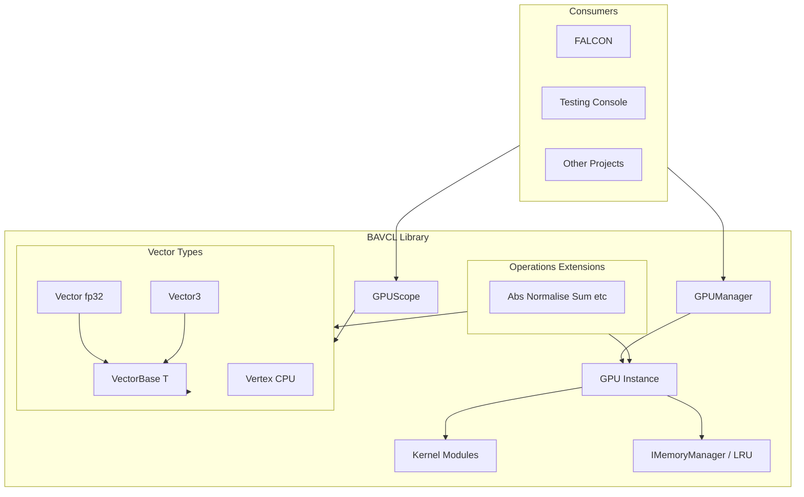
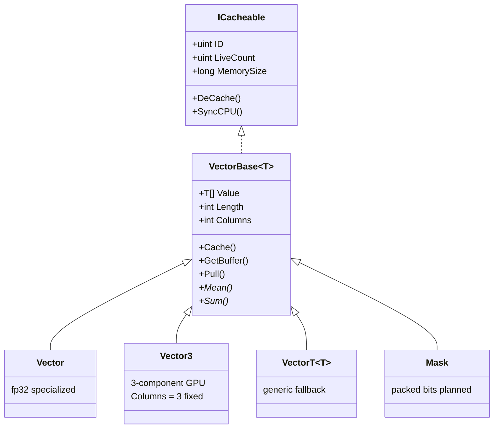
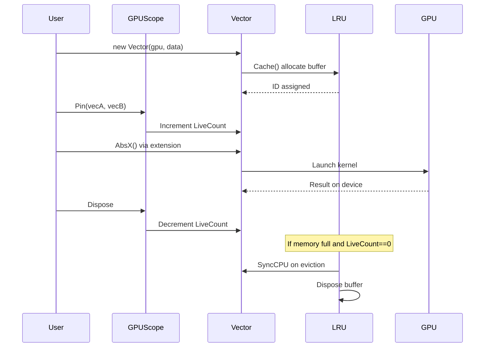
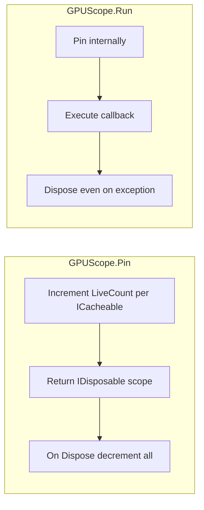
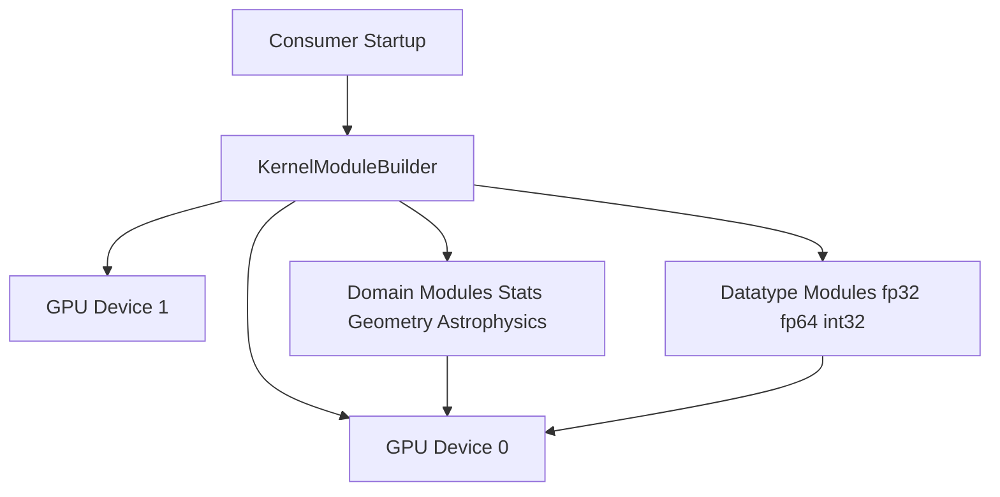
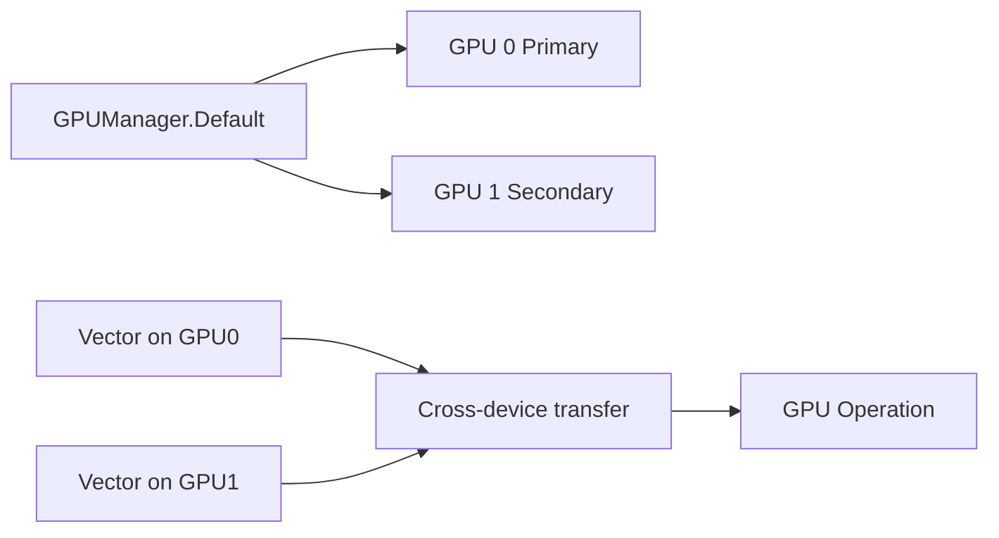

# BAVCL Specification

Authoritative reference for intended behavior. When code disagrees, this spec is the target.

**Version:** Discovery draft — July 2026
**Author:** Marcel Pawelczyk
**Status:** PROGRAM STILL IN DEVELOPMENT

Document Disclaimer: This document is intended for AI coding tools for reasoning and project alignment. While the contents may be beneficial for human use, the content may be verbose.

---

## Table of Contents

1. [Identity and Scope](#1-identity-and-scope)
2. [Design Principles](#2-design-principles)
3. [Architecture Overview](#3-architecture-overview)
4. [Current Functionality (v0)](#4-current-functionality-v0)
5. [Type System Roadmap](#5-type-system-roadmap)
6. [Mask Specification](#6-mask-specification)
7. [Kernel Module System](#7-kernel-module-system)
8. [GPU and Memory](#8-gpu-and-memory)
9. [Code Organization Roadmap](#9-code-organization-roadmap)
10. [CPU Execution Path](#10-cpu-execution-path)
11. [Geometry Module](#11-geometry-module)
12. [Astrophysics Module](#12-astrophysics-module)
13. [IO Module](#13-io-module)
14. [Plotting](#14-plotting)
15. [Experimental Math](#15-experimental-math)
16. [Testing and Quality](#16-testing-and-quality)
17. [Platform Support](#17-platform-support)
18. [Deferred / Nice-to-Have](#18-deferred--nice-to-have)
19. [Code vs Vision Gaps](#19-code-vs-vision-gaps)
20. [Related Projects](#20-related-projects)

---

## 1. Identity and Scope

### 1.1 What BAVCL Is

**BAVCL** is a **C# GPU-accelerated numerics library** built on [ILGPU](https://ilgpu.net/) 1.5.3. It provides NumPy-_inspired_ vector math with C#-idiomatic APIs — not a direct NumPy port.

| Attribute        | Value                                                  |
| ---------------- | ------------------------------------------------------ |
| Language         | C# (.NET 10)                                           |
| GPU runtime      | ILGPU 1.5.3 + ILGPU.Algorithms                         |
| Distribution     | Source-only project reference                          |
| License          | Personal, educational, academic use — see`License.txt` |
| Primary consumer | **FALCON** (astrophysics application)                  |

### 1.2 Purpose

General-purpose GPU data-science / numerics for C# projects.

BAVCL accelerates large array operations on CUDA, OpenCL, or CPU backends while keeping smaller workloads on efficient CPU paths (SIMD). Actual backend implementation is dependant on ILGPU's implementation so this statement may not be correct.

### 1.3 Audience

- FALCON project (My Master's project)
- Academic and educational use per license restrictions

### 1.4 Solution Structure

```
BAVCL.sln
├── BAVCL/                  # Core library (net10.0)
└── Testing Console/        # Demo app + BenchmarkDotNet harness

BAVCL.Tests/                # Sibling repo — canonical test home
└── (separate solution at C:\Users\marce\Repos\BAVCL.Tests)
```

### 1.5 Out of Scope (v1) - Currently

- Matrix linear algebra (deferred)
- Table / dataframe structures (deferred)
- Public NuGet packaging

---

## 2. Design Principles

### 2.1 C#-Idiomatic API

Inspired by NumPy semantics but shaped for C# conventions: explicit types, properties, operator overloads, extension methods, and `IDisposable` patterns.

### 2.2 Specialized + Generic Types

- **Specialized types** where they add value: `Vector` (fp32), `Vector3`, future `VectorInt`, `Mask`, etc.
- **Generic `Vector<T>`** as fallback when no specialized type exists
- Rule: use specialized type when available; fall back to generic

### 2.3 CPU-Default / GPU-`X` Pattern

| Suffix   | Execution                      | When to use                      |
| -------- | ------------------------------ | -------------------------------- |
| _(none)_ | CPU (SIMD where implemented)   | Default; small arrays; debugging |
| `X`      | GPU-accelerated (ILGPU kernel) | Large arrays; requires`GPUScope` |

Examples: `Abs()` vs `AbsX()`, `Sum()` vs `SumX()` (planned), `Reverse()` vs `ReverseX()`.

### 2.4 Scope-Only GPU Pinning (TARGET - WIP)

`LiveCount` is managed **exclusively** by `GPUScope`. Individual operations do **not** self-pin. Callers must wrap GPU work:

```csharp
// Multi-statement blocks
using var scope = GPUScope.Pin(vecA, vecB, vecC);
var temp = vecA.AbsX();
var result = temp + vecB;

// Single expressions
var result = GPUScope.Run(vecA, vecB, () => vecA.AbsX() + vecB);
```

CPU operations (`Abs`, `Sum`, etc.) require no scope.

### 2.5 Pluggable Memory Management

`IMemoryManager` interface allows alternative strategies. Default: LRU auto-cache with configurable memory cap (80% of device memory).

### 2.6 Extension-Method Organization (Target - WIP)

Data types stay thin. Operations live in `Operations/` as extension methods — one file per operation family across all supported types (e.g. `Normalise.cs` handles fp32, fp64, int32).

### 2.7 Source-Only Distribution

Consumers reference the BAVCL project directly. No NuGet packaging planned YET.

---

## 3. Architecture Overview

### 3.1 High-Level Component Diagram



### 3.2 Type Hierarchy



**`VectorBase<T>`** is the abstract base for **any** vector type. It defines:

- GPU caching lifecycle (`Cache`, `DeCache`, `SyncCPU`, `GetBuffer`, `UpdateCache`)
- Shape parameters (`Length`, `Columns`, `ID`, `LiveCount`)
- Host-side data array (`Value[]`)
- Common utilities (`Pull`, `Shape`, `RowCount`, abstract reductions)

It is **not** a "CPU mirror" — it is type-agnostic vector infrastructure shared by all vector kinds.

### 3.3 GPU Lifecycle



### 3.4 GPUScope Flow



| API                                 | Use case                           |
| ----------------------------------- | ---------------------------------- |
| `GPUScope.Pin(params ICacheable[])` | Multi-statement GPU blocks         |
| `GPUScope.Run(cacheables, Func<T>)` | Single expressions; exception-safe |
| `GPUScope.Run(cacheables, Action)`  | Void GPU blocks                    |

Nested scopes are supported via `Interlocked` refcount on `LiveCount`.

### 3.5 Kernel Module Registration (Target - WIP)



Modules are registered per `GPU` instance at startup. Only requested domain × datatype kernels are compiled and loaded.

### 3.6 Multi-GPU Data Flow (Target - WIP)



---

## 4. Current Functionality (v0)

This section documents **what exists in code today**. See [Section 19](#19-code-vs-vision-gaps) for divergences from the target design.

### 4.1 Entry Points

| Entry                       | Location                            | Role                                        |
| --------------------------- | ----------------------------------- | ------------------------------------------- |
| `GPUManager.Default`        | `BAVCL/Services/GPUManager.cs`      | Singleton lazy GPU; CUDA > OpenCL > CPU     |
| `GPUManager.GetGPU()`       | same                                | Create GPU with memory cap (default 0.8)    |
| `GPUManager.GetGPU<TMem>()` | same                                | GPU with custom`IMemoryManager`             |
| `GPU.LoadKernels()`         | `BAVCL/Core/GPU/Kernels/kernels.cs` | Compile all kernels at startup (monolithic) |

### 4.2 Vector (float32)

**Type:** `BAVCL.Vector` — `sealed partial class : VectorBase<float>`
**Files:** 25 partial-class files under `BAVCL/Core/Vector/`

#### 4.2.1 Construction and Properties

| Method / Property                             | Description                                |
| --------------------------------------------- | ------------------------------------------ |
| `Vector(GPU, float[], columns=0, cache=true)` | Construct from array; `columns=0` row 1D (default), `1` column, `N>1` matrix |
| `Vector(GPU, int length, columns=0)`          | Uninitialized length (may contain garbage) |
| `Copy(cache=true)`                            | Deep copy                                  |
| `Equals(Vector)`                              | Element-wise equality after CPU sync       |
| `Shape()`                                     | `(rows, cols)` tuple                       |
| `Flatten()`                                   | Set `Columns = 0` (1D row storage)         |
| `ToVector3()`                                 | Convert when length % 3 == 0               |

#### 4.2.2 Statistical Properties (CPU)

| Method           | Implementation                                             | Notes    |
| ---------------- | ---------------------------------------------------------- | -------- |
| `Sum()`          | CPU SIMD (`System.Numerics.Vector<float>`); Kahan for ≥10⁴ | Override |
| `Mean()`         | `Sum() / Length`                                           |          |
| `Var()`          | SIMD for small; GPU`differenceSquared` for large           |          |
| `Std()`          | `Sqrt(Var())`                                              |          |
| `Min()`, `Max()` | CPU after`SyncCPU()`                                       |          |
| `Range()`        | `Max - Min`                                                |          |

#### 4.2.3 Factory Methods

| Method                                       | Description          |
| -------------------------------------------- | -------------------- |
| `Zeros(gpu, length, columns)`                | Zero-filled vector   |
| `Ones(gpu, length, columns)`                 | Ones-filled          |
| `Fill(gpu, value, length, columns)`          | Constant fill        |
| `Arange(gpu, start, end, interval, columns)` | Range with step      |
| `Linspace(gpu, start, end, steps, columns)`  | Evenly spaced values |
| `Arange(...)` / `Linspace(...)` static       | Return`float[]` only |

#### 4.2.4 Element-wise and Unary Operations

| Operation  | CPU               | GPU (`X`)                 | In-place (`_IP`) |
| ---------- | ----------------- | ------------------------- | ---------------- |
| Abs        | `Abs`, `Abs_IP`   | `AbsX`, `AbsX_IP`         | yes              |
| Reciprocal | —                 | GPU kernel                | `Reciprocal_IP`  |
| Rsqrt      | CPU path          | `RsqrtX`, `RsqrtX_IP`     | yes              |
| Reverse    | —                 | `ReverseX`, `ReverseX_IP` | yes              |
| Diff       | `Diff`, `Diff_IP` | GPU kernel                | yes              |
| NanToNum   | —                 | `nanToNumKernel`          | `Nan_to_num_IP`  |
| Normalise  | CPU               | via divide                | `Normalise_IP`   |
| Log        | —                 | `LogKernel`               | `Log_IP`         |

#### 4.2.5 Binary Operations and Operators

Binary `+`, `-`, `*`, `/`, `^` operator overloads use **NumPy-style element-wise broadcast** via `OP()` / `IPOP()`. Three separate API families exist for different semantics:

| Family | Methods | Semantics |
| ------ | ------- | --------- |
| **Broadcast (default)** | `OP`, `IPOP`, operators | NumPy element-wise broadcast via `broadcastOpKernel` / `broadcastOpKernelIP` |
| **Matrix calculator** | `MatrixAdd`, `MatrixSubtract`, `MatrixDivide`, `MatrixPow`, `MatrixMultiply`, `Cross` | Strict 2D rules: same shape for add/sub/div/pow; inner-dimension match for multiply |
| **Row reduction** | `ReduceOP` | `reduceRowOpKernel` — one output per matrix row (not broadcast, not matmul) |

| Method                        | Description                              |
| ----------------------------- | ---------------------------------------- |
| `OP(vecA, vecB, Operations)`  | NumPy broadcast element-wise             |
| `OP(vec, scalar, Operations)` | Vector-scalar                            |
| `IPOP(vecB, Operations)`      | In-place broadcast when left shape equals output shape |
| `IPOP(scalar, Operations)`    | In-place vector-scalar                   |
| `MatrixAdd` / `MatrixSubtract` / `MatrixDivide` / `MatrixPow` | Identical `(M,N)` matrices, element-wise |
| `MatrixMultiply` / `Cross`    | Matrix multiply `(M,K) × (K,N)` — `Cross` is the primary name; `MatrixMultiply` is an alias |
| `ReduceOP(vector, matrix, op)` | 1D row coefficient (`Columns=0`), length == matrix columns; allocates output length == matrix rows |
| `Dot(vecA, vecB)`             | Scalar inner product (equal length only) |

**`Operations` enum** (`BAVCL/Core/Enums/Operations.cs`): `multiply`, `add`, `subtract`, `divide`, `pow`, `flipDivide`, `flipSubtract`, `flipPow`, `differenceSquared`, `distance`, `magnitude`.

**Storage (`Columns`):**

| `Columns` | Logical shape | Example |
| --------- | ------------- | ------- |
| `0` (default) | `(1, N)` row | `[1,2,3,4]` |
| `1` | `(N, 1)` column | `[[1],[2],[3],[4]]` |
| `N > 1` | `(Length/N, N)` matrix | `[[1,2,3],[4,5,6]]` |

`RowCount()` and `Shape()` derive from `Columns` and `Length` as above. `Is1D()` is true only when `Columns == 0`.

**No in-place row reduce:** `ReduceIPOP` is intentionally omitted. Row reduction reads a full coefficient vector (`Length == matrix.Columns`) and writes one scalar per row (`Length == matrix.RowCount()`). A single buffer cannot satisfy both layouts except on square matrices, and even then the row-wise kernel reads every coefficient element on each thread while writing row outputs into the same buffer — unsafe GPU aliasing without a coefficient snapshot. A column-wise per-thread scheme would avoid aliasing but would not implement shared-coefficient row reduction and would harm row-major coalescing. Use allocating `ReduceOP` instead.

**Broadcasting:** `broadcastOpKernel` / `broadcastOpKernelIP` derive per-operand indices from logical shape (`rows==1` → column index, `cols==1` → row index, scalar → 0, else `flatOut`). Operand shapes and `outCols` are passed as `SpecializedValue<int>` for compile-time branch folding. Incompatible shapes throw `ShapeMismatchException`. `IPOP` throws `PerformanceException` (prefix: *This operation will lead to degraded performance:*) when the left operand would need resizing.

**Note:** `Vector3.Cross` is a separate optimised 3D geometric kernel — not related to `Vector.Cross` (matrix multiply).

**Note:** Unary `+` operator currently calls `AbsX` (likely unintentional).

#### 4.2.6 Structural Operations

| Method                                   | Description                                 |
| ---------------------------------------- | ------------------------------------------- |
| `Transpose` / `Transpose_IP`             | GPU transpose kernel                        |
| `Dot(vecA, vecB)` / `Dot(scalar)`        | Dot product                                 |
| `Concat(vecA, vecB, axis, warp)`         | Concatenate along axis                      |
| `Append` / `Prepend`                     | Vector append                               |
| `Merge`                                  | Merge vectors                               |
| `GetSliceAsVector` / `GetSliceAsArray`   | Slice by row or column                      |
| `GetColumnAsVector` / `GetColumnAsArray` | Column extraction                           |
| `GetRowAsVector` / `GetRowAsArray`       | Row extraction                              |
| `TransferBuffer`                         | Copy GPU buffer reference to another vector |
| `All()`                                  | True if no zero values                      |

#### 4.2.7 Output

| Method                          | Description      |
| ------------------------------- | ---------------- |
| `Print(decimalplaces, syncCPU)` | Console output   |
| `ToStr(decimalplaces, syncCPU)` | Formatted string |
| `ToCSV()` (via `VectorBase`)    | CSV string       |

### 4.3 Vector3 (GPU 3D)

**Type:** `BAVCL.Geometric.Vector3` — `sealed partial class : VectorBase<float>`, `Columns` fixed at 3
**Files:** 15 partial-class files under `BAVCL/Geometric/Vector3/`

| Category     | Methods                                                                            |
| ------------ | ---------------------------------------------------------------------------------- |
| Construction | `Vector3(gpu, float[])`, `Vector3(gpu, int length)` — length must be multiple of 3 |
| Conversion   | `ToVector()`, `ToVector(columns)` — TODO: optimize buffer ID reuse                 |
| Factory      | `Zeros(gpu, length)`, `Fill(gpu, value, length)`                                   |
| Operators    | `+`, `-`, `*`, `/`, `^` with Vector3 and float (all GPU via `OP`)                  |
| Geometry     | `Cross(vecA, vecB)`, `Magnitude()`, `Magnitude(vecA, vecB)`, `Distance(vec)`       |
| Per-row ops  | `VOP(vec, op)`, `VOP(vecA, vecB, op)` → returns `Vector` of per-row results        |
| Indexing     | `this[int row, Coord]`, `GetAt`, `SetAt` with `IndexingMode`                       |
| Concat       | With`Vector3`, `Vertex`, arrays, lists                                             |
| Access       | `AccessRow(vec, row)`                                                              |
| Copy         | `Copy()`                                                                           |
| Stats        | `Mean()`, `Range()`, `Sum()` — **marked TODO: not suitable for vec3**              |

**Known bugs:** `Magnitude.cs` and `Distance.cs` throw wrong error message ("Cross Product" instead of length mismatch).

### 4.4 Vertex (CPU 3D)

**Type:** `BAVCL.Geometric.Vertex` — `struct`, CPU-only, complementary to `Vector3`

| Category            | Methods                                                              |
| ------------------- | -------------------------------------------------------------------- |
| Construction        | `(x,y,z)`, `(float[])`, `(double x,y,z)`                             |
| Presets             | `UP`, `DOWN`, `FORWARD`, `BACKWARD`, `LEFT`, `RIGHT`                 |
| Operators           | `+`, `-`, `*`, `/` with Vertex and float                             |
| Math                | `Magnitude`, `Distance`, `Dot`, `Cross`, `UnitVector`, `Fract`       |
| Rendering           | `Reflect`, `Refract`, `NormalReflectance`, `Aces_approx`, `Reinhard` |
| Component setters   | `SetX`, `SetY`, `SetZ`                                               |
| Implicit conversion | From`Vector3` (pulls full array)                                     |

### 4.5 GPU Infrastructure

#### 4.5.1 GPU Class

`BAVCL.GPU` — wraps `Accelerator` + `IMemoryManager`. Provides allocation, buffer lookup, GC, kernel delegates, `Dispose()`.

#### 4.5.2 Compiled Kernels (v0)

Loaded in `LoadKernels()` — all at once:

| Kernel                                    | Purpose                                         |
| ----------------------------------------- | ----------------------------------------------- |
| `appendKernel`                            | Append rows                                     |
| `nanToNumKernel`                          | Replace NaN/Inf                                 |
| `getSliceKernel`                          | Slice extraction                                |
| `a_opFKernel` / `s_opFKernel`             | Binary ops (array/scalar)                       |
| `a_FloatOPKernelIP` / `s_FloatOPKernelIP` | In-place binary ops                             |
| `broadcastOpKernel` / `broadcastOpKernelIP` | NumPy-style element-wise broadcast (per-operand index from shape, coalesced `flatOut`) |
| `reduceRowOpKernel` | Row-wise vector-matrix reduction (`ReduceOP`) |
| `matmulKernel`                            | Matrix multiply (`Cross` / `MatrixMultiply`)    |
| `simdVectorKernel`                        | Per-row 3-wide ops (Vector3 magnitude/distance) |
| `diffKernel`                              | Adjacent difference                             |
| `reverseKernel`                           | Reverse in-place                                |
| `absKernel`                               | Absolute value                                  |
| `rcpKernel`                               | Reciprocal                                      |
| `rsqrtKernel`                             | Reciprocal sqrt                                 |
| `crossKernel`                             | 3D cross product                                |
| `transposekernel`                         | Matrix transpose                                |
| `LogKernel`                               | Log with configurable base                      |

**Not loaded:** `TestSQRTKernel`, `TestMYSQRTKernel` (throw `KernelNotCompiledException` if called).

#### 4.5.3 LRU Memory Manager

`BAVCL.Core.LRU` implements `IMemoryManager`:

- `ConcurrentDictionary<uint, Cache>` tracks GPU buffers
- LRU queue for eviction order
- `AvailableMemory` = device memory × cap (default 80%)
- `MemoryUsed` tracked via `sizeof(T) × length` estimates
- On eviction when `LiveCount == 0`: sync to CPU via `SyncCPU(buffer)`, dispose buffer
- `GC(memRequired)` evicts until space available

**TODOs in code:** dirty-flag to skip unnecessary CPU sync; only sync if data changed.

### 4.6 IO

`BAVCL.IO.IO` — basic file read/write:

| Method                                        | Format   | Notes                         |
| --------------------------------------------- | -------- | ----------------------------- |
| `WriteToFile(string, filename, format, path)` | txt      | Raw string                    |
| `WriteToFile(IIO, filename, format, path)`    | txt, csv | Via`ToFileFormat`             |
| `CSV2Vector(gpu, filename, format, path)`     | csv      | Parses comma-separated floats |
| `ToFileFormat(writable, format)`              | txt, csv |                               |

Output directory: `{path}/saved_data/`. Default path: `AppDomain.CurrentDomain.BaseDirectory`.

### 4.7 Extensions

`BAVCL/Extensions/` — utility extensions:

| File          | Extensions                                                                                    |
| ------------- | --------------------------------------------------------------------------------------------- |
| `Print.cs`    | `Print()` for float, int, uint, long arrays; double overloads throw `NotImplementedException` |
| `ToString.cs` | `ToStr()` for float arrays                                                                    |
| `Sum.cs`      | `Sum()` for float arrays                                                                      |
| `Average.cs`  | `Average()` for float, int, long arrays                                                       |
| `Min.cs`      | `Min()` for float, int arrays                                                                 |
| `Max.cs`      | `Max()` for float, int arrays                                                                 |

### 4.8 Experimental Math

`BAVCL/Experimental/TestCls.cs` (~820 lines) — fast approximations for sqrt, cbrt, log2. Referenced from kernel experiments. Multiple commented-out alternate implementations. Not production-tested.

### 4.9 Plotting (Prototype)

`BAVCL/Plotting/Plotter.cs` — `Noise()` and `Line()` using `System.Drawing`. Windows-only. Hardcoded save path to legacy `DataScience` repo location.

### 4.10 Stubs

| Type              | State                                                                    |
| ----------------- | ------------------------------------------------------------------------ |
| `Matrix`          | Constructor throws`NotImplementedException`; only `MatrixLength()` works |
| `Table`           | Empty class                                                              |
| `Core/Mask/`      | Empty folder                                                             |
| `Core/VectorInt/` | Empty folder                                                             |
| `Astrophysics/`   | Empty folder                                                             |
| `BAVCL/Tests/`    | Empty folder (non-authoritative)                                         |

### 4.11 Utility

`BAVCL/Util.cs` — `IsClose()` for float comparison with NaN/Inf handling.

---

## 5. Type System Roadmap

### 5.1 Priority Order

Broadening beyond fp32 is the **top priority**:

1. **float64 / double** — `VectorDouble` or `Vector<double>`
2. **int32** — `VectorInt`
3. **int64**
4. **uint**
5. **Mask** — packed-bit boolean mask (see Section 6)
6. **Complex** — ideally `System.Numerics.Complex` as unmanaged struct; may require custom `ComplexFloat` if constraints block it

### 5.2 Specialized vs Generic Rules

```
IF specialized type exists for T
    USE specialized type (Vector, Vector3, VectorInt, Mask, ...)
ELSE
    USE Vector<T> generic
```

### 5.3 Matrix and Table

Nice-to-have, **not** near-term. Vector 2D layout (`Columns > 1`) covers current matrix-like needs.

---

## 6. Mask Specification

### 6.1 Storage

**Packed bits** for GPU efficiency — multiple boolean flags per machine word. Values are strictly 0 or 1.

Exact layout (bits per word, alignment) to be **benchmark-driven** on target GPUs.

### 6.2 Apply Semantics

```
Vector * Mask => Vector
```

Masked-out elements receive a **configurable fill value** (default 0):

```csharp
vector.ApplyMask(mask, fill: 0f)   // default
vector.ApplyMask(mask, fill: float.NaN)
```

### 6.3 Filtering

Mask can also filter/compacted data (exclude masked elements) — detailed API TBD during implementation.

---

## 7. Kernel Module System

### 7.1 Module Dimensions

Two axes of modularity:

| Axis         | Examples                                          |
| ------------ | ------------------------------------------------- |
| **Domain**   | Statistics, Geometry, LinearAlgebra, Astrophysics |
| **Datatype** | fp32, fp64, int32, int64, uint                    |

### 7.2 Registration

- Registered per `GPU` instance at startup
- **Builder pattern** for selective module loading
- Only requested kernels are compiled — reduces startup latency vs current monolithic `LoadKernels()`

### 7.3 Target API (Conceptual)

```csharp
var gpu = GPUManager.Configure()
    .WithModules(KernelDomain.Statistics, KernelDomain.Geometry)
    .WithTypes(DataType.Float32, DataType.Float64)
    .Build();
```

---

## 8. GPU and Memory

### 8.1 Device Selection

Preference order: **CUDA > OpenCL > CPU**. Tie-break by `MaxConstantMemory`. `forceCPU` flag available.

### 8.2 Memory Cap

Default: 80% of device memory (`memoryCap = 0.8f`). Configurable per `GetGPU()` call.

### 8.3 Pluggable Memory Manager

`IMemoryManager` contract (`BAVCL/Core/Interfaces/IMemoryManager.cs`):

- `Allocate`, `AllocateEmpty`, `UpdateBuffer`
- `GetBuffer`, `GC`, `GCItem`
- `AvailableMemory`, `MemoryUsed`, `PrintMemoryUsage`

Alternative implementations can replace LRU without changing vector types.

### 8.4 GPUScope (Target)

See Section 2.4. Debug builds should validate `LiveCount > 0` before kernel dispatch.

### 8.5 Actual GPU Memory Tracking (Exploration) - Planned future

**Goal:** Query or track real GPU memory consumption instead of relying solely on `sizeof(T) × length` estimates.

Benefits:

- More accurate `MemoryUsed` reporting
- Faster allocation decisions (less estimation overhead in `GC()`)
- Better eviction timing

`IMemoryManager.PrintMemoryUsage` TODO: Bytes/KB/GB display formats.

Feasibility depends on ILGPU and device APIs — document as investigation item.

### 8.6 Dirty-Flag Optimization (Future)

Track CPU/GPU data divergence to avoid unnecessary `SyncCPU()` and eviction syncs. TODOs exist in `SyncCPU.cs` and `LRU.cs`.

### 8.7 Multi-GPU (Target)

- `GPUManager.Default` for primary device
- API to enumerate and create additional `GPU` instances
- Cross-device data transfer when operands reside on different GPUs
- Automatic workload distribution: **deferred**

---

## 9. Code Organization Roadmap

### 9.1 Current State

Operations are spread across **25+ partial class files** per type (`Core/Vector/*.cs`, `Geometric/Vector3/*.cs`). This creates maintenance burden and duplication as types are added.

### 9.2 Target Layout

```
BAVCL/
  Core/
    Vector/
      Vector.cs              # Slim: constructors, shape, ICacheable only
    Vector3/
      Vector3.cs             # Slim: constructors, Columns=3 fixed
    VectorDouble/
      VectorDouble.cs        # Future
    Operations/
      Abs.cs                 # Abs(), AbsX(), Abs_IP(), AbsX_IP() for all types
      Normalise.cs
      Sum.cs
      Transpose.cs
      ...
    GPUScope.cs
  Geometric/
    Vertex.cs
  Services/
    GPUManager.cs
```

### 9.3 Migration Strategy

1. Introduce `GPUScope` and remove manual `LiveCount` from operations
2. Extract first operation family (e.g. `Abs`) to extension methods as proof-of-concept
3. Migrate remaining operations file-by-file
4. Collapse partial classes into slim type definitions
5. Apply same pattern to `Vector3`

### 9.4 .NET 11 Discriminated Unions

Evaluate C# DUs (expected .NET 11) to reduce per-type operation boilerplate. Until then, multi-type methods live in shared operation files.

---

## 10. CPU Execution Path

### 10.1 Contract

| Pattern                                 | Execution                    | Scope required   |
| --------------------------------------- | ---------------------------- | ---------------- |
| `Abs()`, `Sum()`, `Mean()`              | CPU (SIMD where implemented) | No               |
| `AbsX()`, `ReverseX()`, operator `OP()` | GPU kernel                   | Yes (`GPUScope`) |

### 10.2 SIMD Usage (v0)

`Vector.Sum()` uses `System.Numerics.Vector<float>` with Kahan summation for arrays ≥ 10⁴ elements. `Var()` uses SIMD for smaller arrays.

### 10.3 Operator Overloads (Target)

Default operators should use CPU paths. GPU variants via `X` suffix or explicit `OPX` methods. **Current code diverges:** all operators route through GPU kernels.

---

## 11. Geometry Module

### 11.1 Vector3 — Permanent Specialized Type

GPU-backed 3D vectors. Length always multiple of 3. `Columns` locked to 3.

Long-term: stays as permanent specialized type (not replaced by generic `Vector<T>`).

**Stats rework:** `Mean()`, `Range()`, `Sum()` on Vector3 need rework or removal — not meaningful as flat-array statistics.

### 11.2 Vertex — Complementary CPU Type

CPU-side `struct` for rendering and ray-tracing helpers: reflect, refract, tone mapping. Works alongside `Vector3`; not deprecated.

### 11.3 Vector3 ↔ Vector Conversion

Target: reuse GPU buffer ID on conversion instead of `Pull()` + reallocate. TODO in `Vector3.cs`.

---

## 12. Astrophysics Module

### 12.1 Scope

Driven by **FALCON** requirements. Primary use case: **age-from-redshift integrals** using astrophysical models (reverse-engineered from Astropy).

### 12.2 Relationship to FALCON

FALCON is the **primary consumer** of BAVCL. Astrophysics operations in BAVCL exist to support FALCON's computational needs.

### 12.3 Detailed Formulas

Specific integral definitions, cosmological parameters, and model variants belong in a FALCON specification or Astrophysics subsection — to be expanded when FALCON integration begins.

### 12.4 FITS I/O

Deferred until core IO formats are polished. FITS is a later priority for astrophysics data interchange.

---

## 13. IO Module

### 13.1 v1 Priority — Polish Existing + Structured Formats

| Format | Status           | Target                                           |
| ------ | ---------------- | ------------------------------------------------ |
| CSV    | Basic read/write | Robust parsing, error handling, column detection |
| TXT    | Basic write      | Consistent formatting                            |
| JSON   | Not implemented  | Serialize/deserialize vector data                |
| XML    | Not implemented  | Structured export                                |
| YAML   | Not implemented  | Human-readable config + data                     |

Commented placeholders in `FileTypes` enum: `FITS`, `JSON`, `XML`.

### 13.2 Later Formats

- FITS (astrophysics)
- NPY (NumPy binary)
- HDF5 (large scientific datasets)

### 13.3 Design Goals

IO is about **reading and writing computed results** — needs more attention than plotting. Should handle BAVCL types (`IIO` implementors) and raw arrays.

---

## 14. Plotting

### 14.1 Current State

Windows-only prototype using `System.Drawing`. Not core to BAVCL.

### 14.2 Target

Cross-platform plotting for debugging and visualization. **Low priority.** Replace `System.Drawing` with a portable library when undertaken.

---

## 15. Experimental Math

### 15.1 Status

Stays in `BAVCL/Experimental/`. Opt-in — consumers import explicitly.

### 15.2 Target State

- Trim to **one best implementation** per function (sqrt, cbrt, log)
- Remove hundreds of lines of commented alternatives
- xUnit tests for accuracy bounds
- Not promoted to production kernels unless explicitly chosen

---

## 16. Testing and Quality

### 16.1 Test Repository

**Canonical home:** `C:\Users\marce\Repos\BAVCL.Tests` (sibling repo, separate solution).

| Aspect           | Current                          | Target                             |
| ---------------- | -------------------------------- | ---------------------------------- |
| Framework        | xUnit (SpecFlow legacy scrapped) | **xUnit only**                     |
| Benchmarks       | BenchmarkDotNet in same project  | Keep BenchmarkDotNet               |
| Target framework | net8.0                           | **net10.0** (align with BAVCL)     |
| Project type     | Exe with`BenchmarkSwitcher`      | Separate test + benchmark concerns |
| Coverage         | Minimal                          | Comprehensive correctness tests    |

### 16.2 Test Strategy

1. **xUnit correctness** — every operation validated against CPU reference or known values
2. **GPU vs CPU parity** — `AbsX()` results match `Abs()` within tolerance
3. **BenchmarkDotNet regression** — performance tracked over time
4. **Experimental math** — accuracy bounds tested

### 16.3 Existing Test Files (Rewrite)

- `Tests/VectorCreationTests.cs`
- `Tests/VectorAccessTests.cs`
- `Tests/VectorOperationsTests.cs`
- `Tests/ArangeTests.cs`
- `Benchmarks/VectorCreationBenchmarks.cs`
- `Benchmarks/VectorOperationsBenchmarks.cs`
- `Benchmarks/MemoryTransferBenchmarks.cs`

### 16.4 CI (Target)

Current: CodeQL security scan only. Target: build + `dotnet test` + benchmark regression gate.

### 16.5 Library Repo Tests Folder

`BAVCL/Tests/` in the library `.csproj` is an **empty placeholder** — non-authoritative. All tests live in BAVCL.Tests.

---

## 17. Platform Support

### 17.1 Targets

Fully cross-platform via ILGPU:

| Backend     | Priority             |
| ----------- | -------------------- |
| NVIDIA CUDA | Highest performance  |
| OpenCL      | Broad GPU support    |
| CPU         | Fallback / debugging |

ILGPU supports GPUs roughly GTX 750 era and newer. BAVCL should match ILGPU's device support.

### 17.2 .NET Version

- **Now:** .NET 10
- **Evaluate:** .NET 11 discriminated unions for operation boilerplate reduction

### 17.3 Known Config Issues

VS Code `launch.json` references `net6.0` but projects target `net10.0` — stale config to fix separately.

---

## 18. Deferred / Nice-to-Have

| Item                        | Notes                             |
| --------------------------- | --------------------------------- |
| Matrix type                 | Full linear algebra — deferred    |
| Table / dataframe           | Columnar named data — deferred    |
| Multi-GPU auto-distribution | Manual device selection first     |
| Public NuGet                | Not planned                       |
| README                      | To be created after spec approval |

---

## 19. Code vs Vision Gaps

When code and this spec disagree, **this spec is the target**.

| #   | Area                 | Current Code                                    | Spec Target                                  | Key Files                            |
| --- | -------------------- | ----------------------------------------------- | -------------------------------------------- | ------------------------------------ |
| 1   | Type breadth         | fp32`Vector` only                               | fp64, int32/64, uint, Mask, Complex          | `Core/Vector/`, empty folders        |
| 2   | Generic types        | `VectorBase<T>` exists; no `Vector<T>`          | Specialized + generic fallback               | `VectorBase/VectorBase.cs`           |
| 3   | CPU/GPU API          | Operators and most ops use GPU kernels          | Default = CPU;`X` = GPU                      | `Vector/Vector.cs`, `Abs.cs`         |
| 4   | LiveCount safety     | Manual Increment/Decrement per op               | Scope-only via`GPUScope.Pin` / `Run`         | All GPU operation files              |
| 5   | LiveCount exceptions | No try/finally — leak on exception              | `GPUScope` guarantees balanced refcount      | `Abs.cs`, `Diff.cs`, etc.            |
| 6   | Kernel loading       | Monolithic`LoadKernels()`                       | Domain × datatype modules, builder           | `kernels.cs`                         |
| 7   | Multi-GPU            | Single`GPUManager.Default`                      | Create/enumerate GPUs; cross-device transfer | `GPUManager.cs`                      |
| 8   | Mask                 | Empty folder                                    | Packed-bit mask, configurable fill           | `Core/Mask/`                         |
| 9   | Matrix/Table         | Stubs throw or empty                            | Deferred                                     | `Matrix/Matrix.cs`, `Table/Table.cs` |
| 10  | Astrophysics         | Empty folder                                    | FALCON integrals (age-from-redshift)         | `Astrophysics/`                      |
| 11  | IO formats           | CSV/TXT only                                    | Polish + JSON/XML/YAML; FITS/NPY/HDF5 later  | `IO/IO.cs`, `Enums/Enums.cs`         |
| 12  | Plotting             | Windows prototype, hardcoded paths              | Cross-platform, low priority                 | `Plotting/Plotter.cs`                |
| 13  | Experimental         | Bloated, untested                               | 1 impl each, xUnit tested                    | `Experimental/TestCls.cs`            |
| 14  | Tests                | BAVCL.Tests needs rewrite; empty library Tests/ | xUnit-only; net10.0; CI                      | `BAVCL.Tests/`                       |
| 15  | Vector3 stats        | Mean/Range/Sum on flat array                    | Rework or remove for 3D semantics            | `Vector3/Vector3.cs`                 |
| 16  | Vector3 errors       | Wrong exception messages                        | Correct messages for magnitude/distance      | `Magnitude.cs`, `Distance.cs`        |
| 17  | Memory sync          | Always syncs on eviction                        | Dirty-flag optimization                      | `SyncCPU.cs`, `LRU.cs`               |
| 18  | Memory accounting    | `sizeof(T) × length` estimate                   | Explore actual GPU memory tracking           | `CalculateMemorySize.cs`, `LRU.cs`   |
| 19  | Code organization    | 25+ partial class files per type                | Extension methods in`Operations/`            | `Core/Vector/*.cs`                   |
| 20  | VectorBase role      | Sometimes described as CPU mirror               | Infrastructure base for all vector types     | `VectorBase/VectorBase.cs`           |
| 21  | Unary`+` operator    | Calls`AbsX`                                     | Should be identity or documented             | `Vector.cs` L148                     |
| 22  | Vector3 buffer reuse | `Pull()` on conversion                          | Pass buffer ID between types                 | `Vector3/Vector3.cs`                 |
| 23  | Vertex + Vector3     | Implicit conversion pulls GPU data              | Complementary; optimize GPU path             | `Vertex.cs`                          |
| 24  | Print extensions     | double/int/long 2D throw NIE                    | Implement or remove overloads                | `Extensions/Print.cs`                |
| 25  | .NET version         | Library net10.0, tests net8.0, launch net6.0    | Align all to net10.0                         | `.csproj`, `launch.json`             |
| 26  | GPUScope             | Does not exist                                  | `Pin()` + `Run()` static IDisposable         | New file needed                      |
| 27  | Kernel modules       | Does not exist                                  | Builder registration per GPU                 | New infrastructure                   |
| 28  | RsqrtX               | `RsqrtX` calls `Rsqrt_IP` not GPU path          | Consistent`X` = GPU naming                   | `Rsqrt.cs`                           |

---

## 20. Related Projects

### 20.1 FALCON

Primary consumer. Astrophysics calculations including age-from-redshift integrals (Astropy-equivalent models reverse-engineered in FALCON). BAVCL provides the GPU numerics foundation.

### 20.2 BAVCL.Tests

Companion test repository at `C:\Users\marce\Repos\BAVCL.Tests`. Source-only sibling referencing BAVCL project. Canonical location for xUnit tests and BenchmarkDotNet benchmarks.

### 20.3 Testing Console

`Testing Console/` in the BAVCL solution — manual smoke tests and benchmark entry point. Not a replacement for BAVCL.Tests.

---

## Appendix A: Configuration Defaults

| Setting                 | Default                       | Location                               |
| ----------------------- | ----------------------------- | -------------------------------------- |
| Memory cap              | 0.8 (80% of device)           | `GPUManager.GetGPU()`                  |
| Accelerator preference  | CUDA > OpenCL > CPU           | `GPUManager._acceleratorPrefOrder`     |
| Auto-cache on construct | `true`                        | `VectorBase` constructor `Cache` param |
| IO output path          | `{BaseDirectory}/saved_data/` | `IO.WriteToFile()`                     |
| Kernels loaded          | All at startup                | `GPU.LoadKernels()`                    |

## Appendix B: Key Interfaces

| Interface        | Purpose                                             |
| ---------------- | --------------------------------------------------- |
| `ICacheable`     | GPU cache contract: ID, LiveCount, DeCache, SyncCPU |
| `ICacheable<T>`  | Typed values access                                 |
| `IMemoryManager` | Pluggable GPU memory strategy                       |
| `IIO`            | CSV/string export contract                          |

## Appendix C: Open Design Items

| Item                                   | Status                                |
| -------------------------------------- | ------------------------------------- |
| Packed-bit mask word layout            | Benchmark-driven                      |
| `System.Numerics.Complex` as unmanaged | May need custom struct                |
| FALCON astrophysics formulas           | Scope defined; details in FALCON spec |
| Actual GPU memory API feasibility      | Investigation                         |
| .NET 11 DU impact on Operations/       | Evaluate when available               |

---

_End of specification. Awaiting approval before implementation planning begins._
