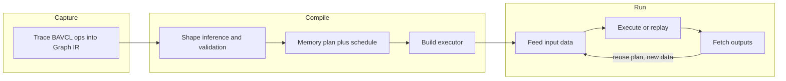
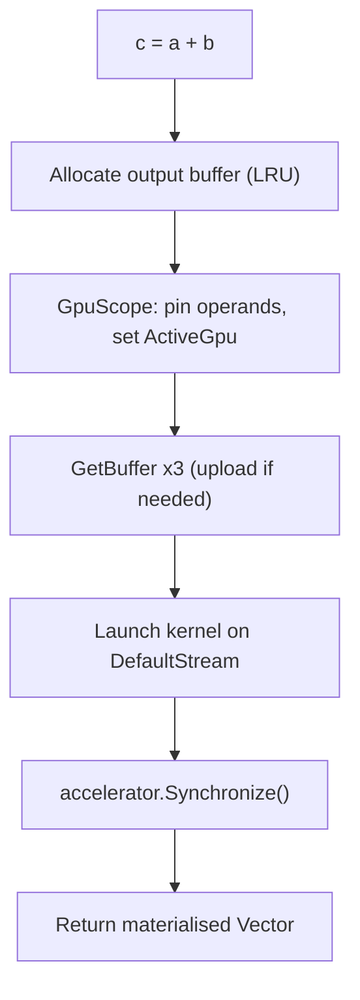
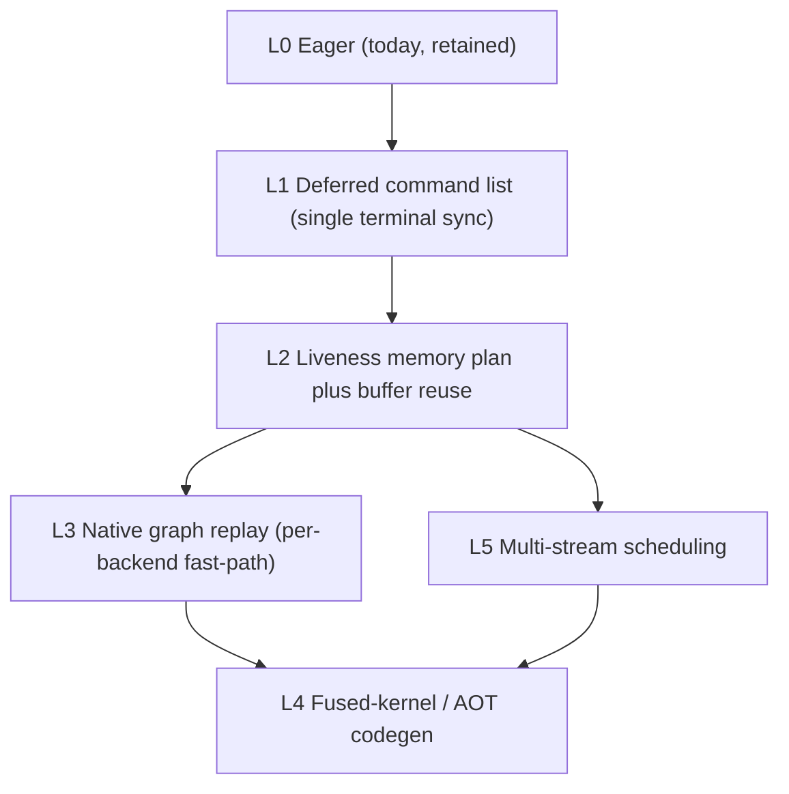
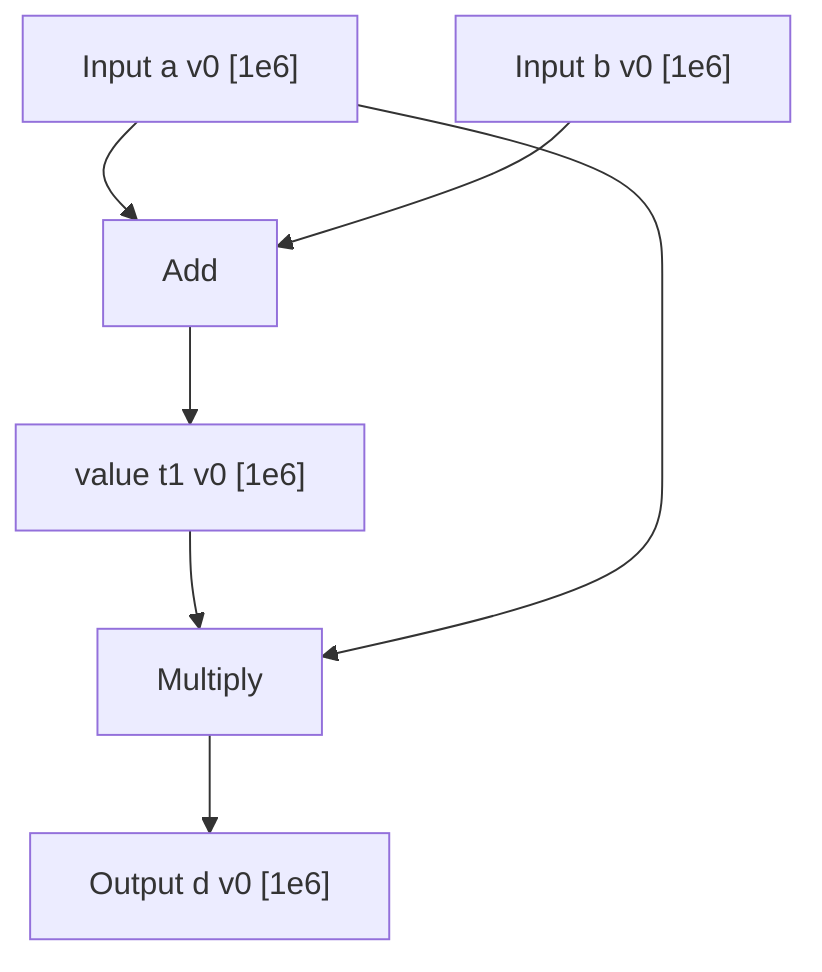
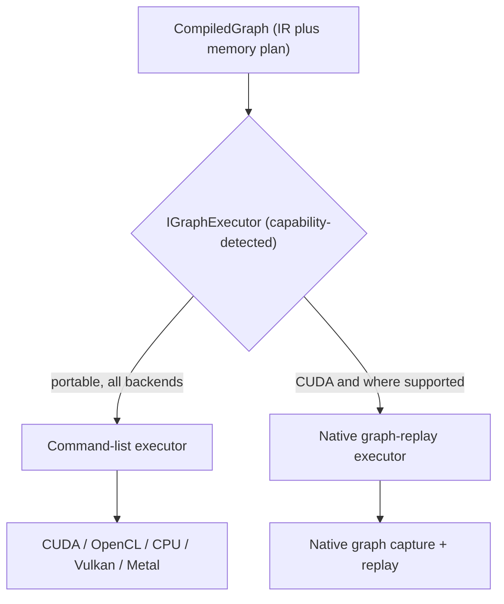
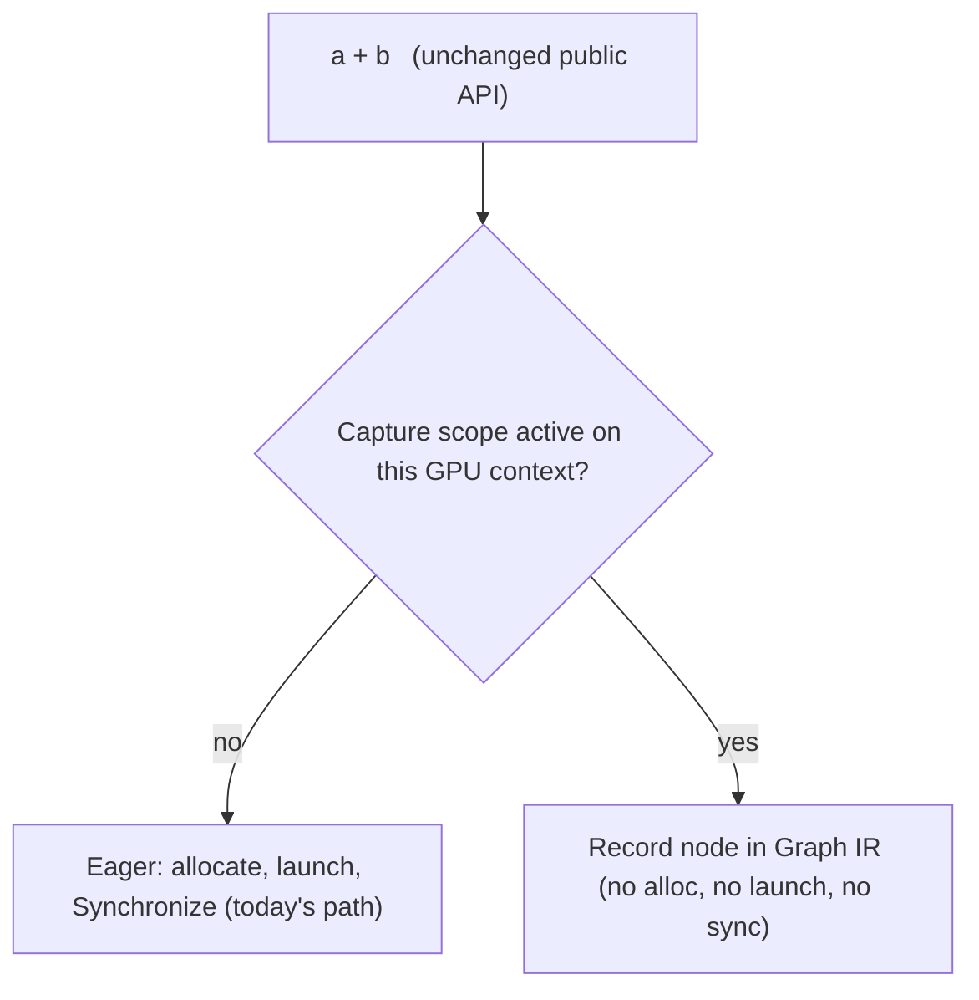
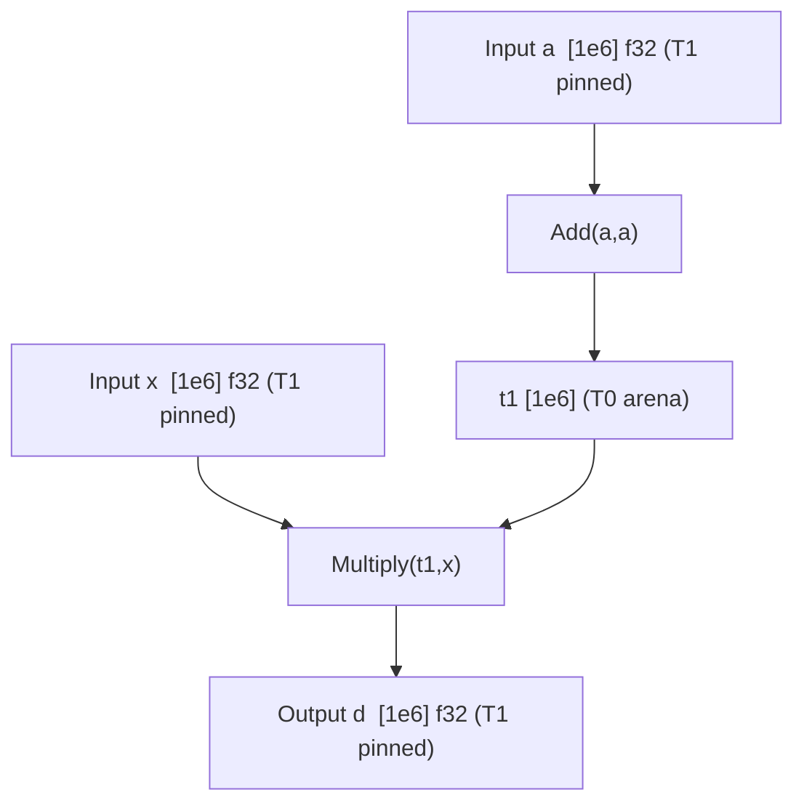

# BAVCL Graph Model Design

Authoritative reference for the intended architecture of BAVCL's execution-graph layer. When code disagrees with this document, this document is the target.

**Version:** Design draft — July 2026
**Author:** Marcel Pawelczyk
**Status:** DESIGN — not yet implemented. Awaiting review and prototype validation.

Document Disclaimer: This document is intended for AI coding tools for reasoning and project alignment. While the contents may be beneficial for human use, the content may be verbose. It is a companion to [BAVCLSpecification.md](BAVCLSpecification.md); that document remains the authoritative specification for BAVCL as a whole, and this document specifies the graph feature in depth.

**Contract note:** This document is authoritative on **architecture direction**. The **v1 scope (Section 5)** and **benchmark milestones (Section 16)** are the **binding contract**. Everything marked _later phase_ or _vision_ is directional and may change once the v1 engine exists and is measured.

---

## Table of Contents

1. [Identity, Scope, and Non-Goals](#1-identity-scope-and-non-goals)
2. [Terminology](#2-terminology)
3. [Motivation and Current Eager Model](#3-motivation-and-current-eager-model)
4. [Layered Architecture](#4-layered-architecture)
5. [v1 Scope (Binding) vs Deferred Coverage](#5-v1-scope-binding-vs-deferred-coverage)
6. [Programming Model: Capture, Compile, Run](#6-programming-model-capture-compile-run)
7. [Graph IR: Nodes, SSA, and Versioning](#7-graph-ir-nodes-ssa-and-versioning)
8. [Shape Inference and Validation](#8-shape-inference-and-validation)
9. [Memory Planner and Tiered Ownership](#9-memory-planner-and-tiered-ownership)
10. [Executor Backends and ILGPU 2.0 Integration](#10-executor-backends-and-ilgpu-20-integration)
11. [Transfer Nodes and Host-Boundary Rules](#11-transfer-nodes-and-host-boundary-rules)
12. [Graph Introspection and Diagnostics](#12-graph-introspection-and-diagnostics)
13. [Public API Compatibility Guarantee](#13-public-api-compatibility-guarantee)
14. [Datatype-Generic Design](#14-datatype-generic-design)
15. [Error Handling and Timing](#15-error-handling-and-timing)
16. [Benchmark Milestones, Success Criteria, and Validation Prototype](#16-benchmark-milestones-success-criteria-and-validation-prototype)
17. [Risks and Mitigations](#17-risks-and-mitigations)
18. [Phased Roadmap](#18-phased-roadmap)
19. [Code vs Vision Gaps](#19-code-vs-vision-gaps)
20. [Open Questions](#20-open-questions)
    - [Appendix A: Proposed Public API Sketch](#appendix-a-proposed-public-api-sketch)
    - [Appendix B: Worked End-to-End Example](#appendix-b-worked-end-to-end-example)

---

## 1. Identity, Scope, and Non-Goals

### 1.1 What the Graph Model Is

The BAVCL graph model is an **execution-optimisation layer that sits _beneath_ the existing BAVCL API**. It lets a sequence of BAVCL operations be **captured** once, **compiled** into a memory-planned, scheduled execution plan, and **run** many times with fresh input data — instead of the current model where every operation eagerly launches a kernel and synchronises immediately.

The graph is **not the product**. BAVCL's product is a C#-idiomatic, GPU-accelerated numerics library. The graph is the machinery that finally exploits the groundwork BAVCL already has (ownership model, residence flags, scopes, modular kernels, LRU) to remove per-operation overhead.

Three phases define the model:



### 1.2 Scope

- Target runtime: **ILGPU 2.0** (alpha at time of writing).
- Backend-agnostic: **CUDA, OpenCL, CPU**, and the newer **Vulkan / Metal** backends of ILGPU 2.0.
- Datatype-generic: operates on any unmanaged `T` (fp32 `Vector`, `Vector3`, the planned `Mask`, and future types).
- Additive: the graph is a new, opt-in surface. Existing eager APIs are unchanged.

### 1.3 Non-Goals

| Non-goal                                      | Rationale                                                                                                        |
| --------------------------------------------- | ---------------------------------------------------------------------------------------------------------------- |
| **Automatic differentiation / gradients**     | BAVCL's consumer (FALCON) is numerics, not ML training. Autograd is explicitly out of scope.                     |
| **Replacing eager mode**                      | Eager remains the default and the escape hatch for work that must happen immediately.                            |
| **A second user programming model**           | Users write normal BAVCL code inside a capture scope; no symbolic graph API to learn (see Section 6).            |
| **Total operation coverage in v1**            | v1 targets a focused, high-value op set (Section 5). Maximal coverage is the north star, not the v1 contract.    |
| **Beating CUDA graphs / kernel fusion in v1** | v1 success is correctness plus removal of per-op sync and allocations (Section 16). Fusion/AOT is a later phase. |

---

## 2. Terminology

Precise vocabulary used throughout this document. Ambiguous lifecycle words are pinned here to avoid implementation surprises.

| Term                                        | Definition                                                                                                                                                  |
| ------------------------------------------- | ----------------------------------------------------------------------------------------------------------------------------------------------------------- |
| **Eager op**                                | The current behaviour: an operation immediately allocates output, launches a kernel, and calls`Synchronize()`.                                              |
| **Capture**                                 | The phase in which BAVCL operations are *recorded* into the Graph IR instead of executed. Delimited by a`Graph.Capture(...)` scope.                         |
| **Trace / tracing**                         | The technique used for capture: running ordinary BAVCL code whose operations record nodes rather than execute.                                              |
| **Graph IR**                                | The intermediate representation: a directed acyclic graph of typed nodes produced by capture.                                                               |
| **Node**                                    | A single recorded operation in the Graph IR (see Section 7 for node kinds).                                                                                 |
| **`GraphTensor<T>`**                        | A symbolic handle that*describes a value* produced during capture. It is **not** a `Vector` and does **not** own memory.                                    |
| **SSA / version**                           | Static Single Assignment. Each logical tensor value is versioned; an in-place mutation produces a new version rather than editing in place at the IR level. |
| **Compile**                                 | The phase that turns the Graph IR into an executable: shape inference, memory planning, scheduling, and executor construction.                              |
| **Memory plan**                             | The compiled decision of which physical buffer backs each tensor value, including reuse.                                                                    |
| **Arena**                                   | A contiguous pool of device memory the planner sub-allocates graph temporaries from.                                                                        |
| **Buffer reuse through ownership transfer** | User-facing name for reusing a buffer when its previous value is dead (e.g. writing an output into an operand's buffer). Internally called*donation*.       |
| **Run / Replay**                            | The phase that feeds inputs and executes the plan._Replay_ specifically means re-executing a compiled native graph (e.g. via one `cuGraphLaunch`).          |
| **Input binding (feed)**                    | A designated tensor whose device buffer is (re)filled with fresh data before each run.                                                                      |
| **Output binding (fetch)**                  | A designated tensor read back (or made available on device) after a run.                                                                                    |
| **Boundary**                                | A point where the graph must stop deferring: an explicit CPU read, or a host control-flow decision on a computed value.                                     |
| **Device scalar**                           | A reduction result kept on the device (logical shape`[1]`) instead of being synced to the CPU.                                                              |
| **Executor**                                | The compiled object that performs a run (`IGraphExecutor`): a portable command-list executor or a native graph-replay executor.                             |
| **Command list**                            | A recorded, ordered sequence of kernel launches / transfers executed on a stream with a single terminal synchronisation.                                    |

---

## 3. Motivation and Current Eager Model

### 3.1 The Current Eager Path (v0)

Every GPU operation in BAVCL today follows one skeleton:

1. Allocate the output buffer eagerly — `new Vector(gpu, length, columns)` calls `CacheEmpty(length)` -> `Gpu.AllocateEmpty<T>` -> `LRU.AllocateEmpty` (which may run `GC()` to evict).
2. Open a `GpuScope.Begin(output, ...inputs)` — pins operands (`IncrementLiveCount`), sets `Residence.ActiveGpu` on the modified operand.
3. Resolve buffers via `GetBuffer()` (uploading from CPU if the operand is CPU-authoritative).
4. Launch exactly one kernel on `accelerator.DefaultStream`.
5. Call **`accelerator.Synchronize()` immediately**.
6. Dispose the scope — `DecrementLiveCount`, transition `ActiveGpu -> Gpu`.
7. Return a fully materialised `Vector`.



### 3.2 Where the Cost Is

- **Per-operation synchronisation.** There are roughly thirty `Synchronize()` call sites, one per operation family. A chain of N operations pays N host round-trips.
- **Per-operation allocation and eviction.** Output buffers are allocated at construction time; under memory pressure the LRU evicts and re-syncs. The library manages memory _reactively at runtime_ because it never knows the full future of a computation.
- **Physical distance dominates.** The dominant cost in GPU numerics of this shape is not arithmetic; it is host-device latency: launch dispatch, synchronisation, and PCIe transfers. Removing avoidable syncs and transfers is the single largest performance lever.
- **Repeated identical pipelines re-pay everything.** A workload such as FALCON's age-from-redshift integrals runs the _same_ operation sequence many times with different inputs. Today each iteration re-pays kernel dispatch, allocation, and synchronisation overhead from scratch.

### 3.3 The Groundwork Already Exists

BAVCL already has the substrate a graph runtime needs. The graph layers on top of it rather than replacing it:

| Existing mechanism                                                          | Role in the graph runtime                                       |
| --------------------------------------------------------------------------- | --------------------------------------------------------------- |
| Ownership /`Residence` flags (`Cpu`/`Gpu`/`InSync`/`ActiveCpu`/`ActiveGpu`) | Basis for tensor authority and buffer-reuse safety              |
| `GpuScope` / `CpuScope` refcounting (`LiveCount`)                           | Basis for pinning buffers across a deferred execution window    |
| `LRU` / `IMemoryManager`                                                    | Retained for eager and out-of-graph tensors (Section 9, Tier 3) |
| Modular kernels (`kernels.cs`, `Modules/*/Internal`)                        | The dispatch seam where recording is injected (Section 13)      |
| `Shape` + `Shape.BroadcastWith`                                             | Reused directly by compile-time shape inference (Section 8)     |
| In-place`_IP` kernels                                                       | Become buffer-reuse hints under the planner (Section 9)         |

---

## 4. Layered Architecture

The design is deliberately **layered so each layer ships independently** and delivers value on its own. This avoids an all-or-nothing rewrite and lets us measure gains incrementally.



| Layer                             | What it buys                                                                                                  | What it costs                                                  | Phase                                                    |
| --------------------------------- | ------------------------------------------------------------------------------------------------------------- | -------------------------------------------------------------- | -------------------------------------------------------- |
| **L0 Eager**                      | Correctness, debuggability, immediate results                                                                 | Per-op sync and allocation                                     | Exists today; retained                                   |
| **L1 Deferred command list**      | Removes per-op`Synchronize()`; batch launches; one terminal sync                                              | Requires recording ops without side effects (the capture seam) | **v1**                                                   |
| **L2 Liveness memory plan**       | Ahead-of-time allocation, buffer reuse, fewer evictions, device-resident intermediates                        | Liveness analysis + planner                                    | **v1**                                                   |
| **L3 Native graph replay**        | Collapses host dispatch to a single launch on replay (measured ~6.6-7x on trivial-kernel microbench for CUDA) | Backend-specific; requires stable pinned buffers               | **v1 fast-path where supported**, else portable fallback |
| **L4 Fused-kernel / AOT codegen** | Fuses elementwise chains into fewer/larger kernels; ahead-of-time compilation                                 | Runtime code generation; significant complexity                | Later phase                                              |
| **L5 Multi-stream scheduling**    | Overlaps independent DAG branches and transfers across streams                                                | Dependency scheduling; backend concurrency caveats             | **v1 foundation**, full scheduling later                 |

**Recommended v1 = L1 + L2 (+ L5 foundation) with first-class diagnostics.** L3 is used as an accelerated replay fast-path only where the backend advertises support; otherwise the portable command-list path (L1/L2) guarantees identical results everywhere. L4 fusion/AOT is explicitly deferred.

> Key insight from review: **L1 alone may deliver a large win** before any sophisticated optimisation, because today's bottleneck is `op -> launch -> Synchronize()` repeated per operation. Simply batching operations and synchronising once can dramatically cut host round-trips.

---

## 5. v1 Scope (Binding) vs Deferred Coverage

The engine must be **correct, working, and measurably faster on a focused op set** before it attempts total coverage. Implementing every structural edge case before a working execution engine exists is the primary failure mode this scope guards against.

### 5.1 In v1 (binding contract)

- **Elementwise / unary ops**: `Abs`, `Reciprocal`, `Rsqrt`, `Log`, `NanToNum`, etc. (GPU `X` variants).
- **Binary / broadcast ops**: `+`, `-`, `*`, `/`, `^`, `OP`, and NumPy-style broadcasting via the existing `broadcastOpKernel` path.
- **Reductions**: `Sum`, `Mean`, `Var`, `Std`, `Min`, `Max`, `Range`, `Dot` — producing **device scalars** (Section 9.5).
- **Transfers**: host-to-device and device-to-host as explicit graph nodes (Section 11).
- **Constants**: captured literal/scalar values baked into the plan.
- **Inputs / outputs**: designated feed/fetch tensors.
- **Capture -> compile -> run** with a liveness memory plan, buffer reuse, diagnostics, and the portable executor (plus native replay where supported).

### 5.2 Deferred to later phases

- Structural ops: `Concat`, `Append`, `Prepend`, `Merge`, `Transpose`, `Reverse`, slicing, reshaping, column/row extraction.
- Indexing and per-element access inside a graph.
- Arbitrary CPU-side compute ops as graph nodes (transfers are in v1; general host compute is not).
- In-graph control flow (conditionals, loops).
- Kernel fusion / AOT code generation (L4).
- Multi-GPU distribution.

### 5.3 Rationale

A focused engine that provably removes syncs and allocations on elementwise/reduction pipelines — the exact shape of FALCON's hot loops — validates the entire direction. Breadth is added afterwards, each op promoted from eager to graph-capable behind the same public API.

---

## 6. Programming Model: Capture, Compile, Run

### 6.1 Construction by Tracing (not a symbolic API)

BAVCL's selling point is that users write ordinary, idiomatic C# and never learn a GPU programming model. The graph preserves this: **users write the same BAVCL code inside a capture scope**, and operations record themselves instead of executing.

```csharp
// Compile once
using var graph = Graph.Capture(gpu);

var a = graph.Input<float>("a", length: 1_000_000);
var b = graph.Input<float>("b", length: 1_000_000);

var c = a + b;        // records an Add node; returns a GraphTensor<float>
var d = c * a;        // records a Multiply node

graph.Output("d", d); // designate a fetch

CompiledGraph plan = graph.Compile();

// Run many times with fresh data
for (int i = 0; i < 1000; i++)
{
    plan.Feed("a", hostA[i]);
    plan.Feed("b", hostB[i]);
    plan.Run();
    float[] result = plan.Fetch("d");
}
```

The rejected alternative — a symbolic builder (`graph.Add(a, b)`) — would force users to learn a second programming model and duplicate the ~280 existing operations. Tracing reuses them directly.

### 6.2 The Three Phases

| Phase       | Determines                                                                | Runs                             |
| ----------- | ------------------------------------------------------------------------- | -------------------------------- |
| **Capture** | _which_ operations and their data dependencies                            | Once, inside`Graph.Capture(...)` |
| **Compile** | _memory + kernels + schedule_ (shape inference, planning, executor build) | Once per shape configuration     |
| **Run**     | _feeds inputs and executes_                                               | Many times                       |

### 6.3 Inputs, Outputs, and Feeds

- **Inputs** are declared during capture (`graph.Input<T>(name, shape)`), producing a `GraphTensor<T>`. Each run refills the input's pinned device buffer with fresh data via `plan.Feed(name, data)`.
- **Outputs** are designated (`graph.Output(name, tensor)`). After `Run()`, they can be fetched to the CPU (`plan.Fetch(name)`) or kept on device for chaining.
- **Intermediates** are entirely graph-managed and never surface to the user.

### 6.4 Fixed Shapes and Recompilation

Native replay and static memory planning require **fixed shapes per compiled graph**.

- A `CompiledGraph` is specialised to the shapes provided at compile time.
- Changing an input shape produces a **new** compiled graph. A **shape-keyed cache** (keyed on the tuple of input shapes) returns an existing plan when shapes repeat, or compiles a new one on first sight.
- This matches the "compile once, run many" workload where shapes are stable across runs.

Shape "buckets" / dynamic dimensions are a possible later enhancement (Section 18); v1 uses fixed-shape-with-recompile.

### 6.5 Capture Purity Rules (v1)

To keep the whole captured region statically compilable and maximally optimisable, a capture scope must be **pure and deferrable**. In v1:

- **CPU reads inside capture are a compile error.** Calling an indexer getter, `ToArray()`, `Print()`, `Equals()`, or using a reduction result in host control flow (`if (v.Sum() > 0)`) inside a capture scope is rejected with a clear diagnostic. Such reads must occur outside the scope, or be expressed as designated outputs.
- **Data-dependent shapes are a compile error.** An operation whose output shape depends on runtime _values_ (not merely on input shapes) cannot be captured in v1.
- **Side-effecting host operations** (`IO`, RNG, mutation of external state) are not recordable; they must sit outside capture.

The alternative (splitting a trace into sequential sub-graphs at each CPU read) is documented as a possible later relaxation but is intentionally excluded from v1 for simplicity and stronger optimisation. Host control flow between separate `Run()` calls is fully supported today — you simply re-run the compiled graph inside a normal C# loop.

---

## 7. Graph IR: Nodes, SSA, and Versioning

### 7.1 `GraphTensor<T>` — a Value Description

`GraphTensor<T>` is the bridge between the existing API and the graph. It is a lightweight, immutable handle that _describes a value_ — its producing node, its datatype `T`, and its (inferred) shape. It is explicitly:

- **not** a `Vector` / `Vector3` / `Mask`,
- **not** an owner of GPU memory,
- **not** something the user allocates directly.

```text
Eager world:   Vector<T>  ->  owns a GPU buffer, holds data
Graph world:   GraphTensor<T>  ->  names a value the plan will compute
```

During capture, operations consume and produce `GraphTensor<T>`. After compilation, each value is bound to a concrete buffer decided by the memory planner (e.g. "value #17 -> arena slot 3"). The user never sees the buffer.

### 7.2 IR Shape

The IR is a **directed acyclic graph** of typed **nodes**. Edges are data dependencies (a node consumes the value versions its inputs produce).



### 7.3 Node Kinds

| Node kind    | Purpose                                                            | v1               |
| ------------ | ------------------------------------------------------------------ | ---------------- |
| **Input**    | A fed value; backed by a pinned buffer refilled each run           | Yes              |
| **Output**   | A fetched value; backed by a pinned buffer read after run          | Yes              |
| **Constant** | A capture-time literal/scalar baked into the plan                  | Yes              |
| **Kernel**   | A device kernel launch (elementwise, broadcast, reduction, matmul) | Yes (v1 op set)  |
| **Transfer** | An explicit host<->device copy (Section 11)                        | Yes              |
| **Host**     | A host-side computation node (arbitrary CPU compute)               | Reserved (later) |
| **Cond**     | A conditional/branch node                                          | Reserved (later) |
| **While**    | A bounded/iterative loop node                                      | Reserved (later) |

The IR reserves `Host`, `Cond`, and `While` so that later phases (arbitrary CPU ops, in-graph control flow) extend the IR rather than reshape it. This is a deliberate forward-compatibility decision.

### 7.4 SSA and Versioning — How In-Place is "Married" to the Graph

The IR uses **Static Single Assignment**: every logical value has a single defining node. This is what makes in-place operations safe inside a graph.

At the API level, an in-place op such as `v.AbsX_IP()` mutates `v`. At the IR level, this is recorded as producing a **new version** of the value:

```text
v.AbsX_IP()   ==>   v(version k+1) = Abs(v(version k))
```

- The IR never truly mutates in place; it records a new version whose _producer_ consumed the previous version.
- Whether the physical buffer is actually reused (true in-place) is a **memory-planning decision** (Section 9.4), not an IR concern.

This cleanly separates _value semantics_ (versioning, always correct) from _storage decisions_ (buffer reuse, an optimisation). It resolves the "marry in-place and graph" problem: in-place memory savings become an automatic outcome of liveness-driven planning, while the versioned IR keeps aliasing correct.

### 7.5 Determinism

Capture records a deterministic op order. The scheduler (L5) may reorder independent nodes across streams, but only where the dependency graph proves independence, and never in a way that changes numerical results within a single node.

---

## 8. Shape Inference and Validation

### 8.1 Reusing the Existing Shape Model

Shape inference reuses BAVCL's existing `Shape` type and `Shape.BroadcastWith`. Each node computes its output shape from its input shapes using the _same_ rules the eager path uses today, guaranteeing identical shape semantics between eager and graph execution.

- Elementwise/unary: output shape == input shape.
- Broadcast binary: `shapeA.BroadcastWith(shapeB)` (existing NumPy-style rules).
- Reduction: output shape `[1]` (device scalar) or per-axis shape for row reductions.
- Matmul (`Cross`): inner-dimension match, `(M,K) x (K,N) -> (M,N)`.

### 8.2 Compile-Time Validation

Shape validation moves from **run time to compile time**. During `Compile()`:

- Incompatible shapes raise `ShapeMismatchException` (the existing exception type), now at compile time with the offending node's name and capture-site information (Section 12).
- Length mismatches raise `LengthMismatchException` similarly.
- Unsupported-in-capture operations raise a clear diagnostic naming the operation and suggesting the eager escape hatch.

This is a net improvement: errors that today surface mid-computation are caught once, up front, before any run.

### 8.3 Shape as Plan Key

Because shapes are fixed per compiled graph (Section 6.4), the fully-inferred shape set is part of the plan's cache key. Two captures with identical structure and shapes resolve to the same `CompiledGraph`.

---

## 9. Memory Planner and Tiered Ownership

Memory management is the single largest performance lever in this class of workload, because host-device latency and allocation/eviction churn dominate cost. The graph's central advantage is that **it knows the entire future of a computation at compile time**, so it can plan memory ahead-of-time instead of managing it reactively.

### 9.1 Design Principle: Maximise Graph Ownership

The graph should own **as much memory as possible**. LRU is reframed from a co-owner into a **shrinking fallback** used only for genuinely dynamic, eager, out-of-graph tensors. Two facts make this not merely a preference but a technical requirement:

1. **Native graph replay requires stable, pinned buffers.** CUDA-style graph capture bakes in concrete device addresses. To replay a compiled graph many times, its input/output/intermediate buffers must be pinned and reused across runs — they cannot be routed through an evicting LRU, or the captured graph becomes invalid.
2. **The graph must own the transfer schedule, not just allocation.** Because transfer/sync latency dominates, the graph keeps intermediates (and reduction scalars) device-resident, models transfers as schedulable nodes, and removes per-op synchronisation. That transfer discipline only works if the graph controls the buffers involved.

### 9.2 Tiered Ownership Model

| Tier                              | Contents                               | Owner                 | Lifetime                         | Uses LRU?          |
| --------------------------------- | -------------------------------------- | --------------------- | -------------------------------- | ------------------ |
| **T0 Arena (temporaries)**        | Graph intermediates and device scalars | Graph planner         | Within a run; reused across runs | No                 |
| **T1 Graph I/O buffers**          | Designated inputs and outputs          | Graph (pinned)        | Compiled-graph lifetime          | No                 |
| **T2 Adopted persistent tensors** | User`Vector`s bound to a graph         | Graph (adopted)       | While bound; returns on unbind   | No (while adopted) |
| **T3 Eager / unbound dynamic**    | Tensors never used in a graph          | LRU /`IMemoryManager` | Dynamic                          | Yes                |

The goal is that **T3 is the exception**, not the default path. Anything that participates in a graph is graph-owned.

### 9.3 Liveness Analysis and the Arena

For T0/T1, the planner computes **liveness** for every value: the interval from its producing node to its last consuming node. From liveness it builds an allocation plan:

- Values with **non-overlapping** live intervals can share the same physical buffer.
- Temporaries are sub-allocated from a contiguous **arena**; the arena is sized once to the peak concurrent live set and reused every run (no per-run allocation).
- Because the plan is fixed, there is **no eviction and no runtime GC** inside a compiled graph.

### 9.4 Buffer Reuse Through Ownership Transfer (In-Place)

When an operand's value is **dead after** the current node (its last use is this op), the planner may write the node's output **into that operand's buffer** — true in-place, chosen automatically:

```text
d = Abs(c)       // if c is dead after this node -> write d into c's buffer
```

- User-facing term: **buffer reuse through ownership transfer**. Internal/compiler term: _donation_.
- Explicit `_IP` methods (`AbsX_IP`, `IPOP`, `Normalise_IP`, ...) become **reuse hints**: they express intent, and the planner honours them when liveness permits, or falls back to a fresh buffer when it does not (rather than producing incorrect aliasing).
- Correctness is guaranteed by the SSA versioning of Section 7.4 combined with conservative liveness.

### 9.5 Device-Resident Scalars (Decided)

Reductions produce a **device scalar** (logical shape `[1]`) that stays on the device and feeds subsequent graph ops directly. The CPU sees it **only** when the user explicitly reads it (an output fetch or a read outside capture).

This keeps reduction-then-op chains fully on-GPU:

```csharp
var norm   = v.Norm();   // device scalar, no CPU sync
var result = v / norm;   // consumes the device scalar on-device
```

Without device scalars, such a chain would force a device-to-host-to-device round trip mid-graph — exactly the latency the graph exists to remove. This is a decided architectural principle; the concrete implementation may land in a later phase, but the IR and planner are designed for it now.

### 9.6 Relationship to Existing Residence, Scopes, and LRU

- The graph planner is a **new allocation path**; it does not remove `Residence`, `GpuScope`, or `LRU`. It builds on the same ownership concepts.
- **Pinning across the deferred window**: during a run, all graph-owned buffers behave as if `LiveCount > 0` for the run's duration — the existing pinning concept, extended from one op to the whole run.
- **T2 adoption**: when a persistent `Vector` is bound to a graph, its authority transfers to the graph's memory domain (its `Residence` reflects graph ownership) and returns on unbind. The precise adoption/unbind handshake with `Residence` flags and scopes is an open implementation item (Section 20).
- **Irreducible floor**: the ILGPU driver still owns the _physical_ allocation primitive, and while the eager escape hatch exists, LRU remains for T3 tensors. "Eliminate the LRU route" is achieved by making the graph own everything that touches a graph — not by deleting the dynamic manager that eager mode still needs.

---

## 10. Executor Backends and ILGPU 2.0 Integration

### 10.1 `IGraphExecutor` — Strict Backend Abstraction

A compiled graph is executed through an `IGraphExecutor`. The core graph engine (IR, shape inference, planner) **must not embed CUDA-specific assumptions**. Backend-specific execution is isolated behind the executor interface so BAVCL never becomes "BAVCL over CUDA graph assumptions".



### 10.2 Portable Command-List Executor (all backends)

The baseline executor works on **every** ILGPU 2.0 backend:

- Executes the planned node order on a dedicated `AcceleratorStream` (created via `accelerator.CreateStream()`), **not** the default NULL stream.
- Uses explicit-stream launchers (`LoadAutoGroupedKernel` / `LoadKernel`), which BAVCL already uses.
- Performs **one terminal synchronisation** per run instead of one per operation (the L1 win).
- Reuses planned buffers (the L2 win); no per-run allocation.

This path guarantees correctness and the core performance wins everywhere, independent of native graph support.

### 10.3 Native Graph-Replay Executor (accelerated fast-path)

Where the runtime advertises native graph capture (e.g. ILGPU's CUDA graph API: `CudaStream.BeginCapture/EndCapture` -> `CudaGraph.Instantiate()` -> `CudaGraphExec.Launch()`), the executor captures the planned command list **once** and **replays** it with a single native launch per run. Reported microbenchmarks show ~6.6-7x reduction in host-dispatch overhead for launch-bound sequences.

- **Capability detection**: the executor checks `SupportsGraphCapture` (or equivalent) at compile time and selects native replay only when available; otherwise it falls back to the command-list executor with identical results.
- **Stream discipline**: capture requires a dedicated, capturable stream. `Accelerator.WithDefaultStream(stream)` reroutes default-stream launches onto the capturable stream so the existing kernel launch sites need no rewrite. The NULL default stream cannot be captured and is avoided.
- **Stable buffers**: replay depends on the pinned buffers from the memory plan (Section 9.1).

### 10.4 Multi-Stream Scheduling (foundation in v1)

Independent branches of the DAG (and transfers vs compute) can run on separate streams for overlap. v1 lays the **foundation** — the scheduler models dependencies and can assign nodes to streams — while full concurrent scheduling and tuning is a later phase. Concurrency is best-effort and subject to backend/hardware limits (some backends serialise under resource pressure or during copies).

### 10.5 Backend Capability Matrix (to be verified against ILGPU 2.0)

| Capability                       | CUDA                | OpenCL            | CPU     | Vulkan    | Metal     |
| -------------------------------- | ------------------- | ----------------- | ------- | --------- | --------- |
| Command-list executor (L1/L2)    | Yes                 | Yes               | Yes     | Yes       | Yes       |
| Multiple streams / overlap       | Yes                 | Backend-dependent | N/A-ish | To verify | To verify |
| Native graph capture/replay (L3) | Yes (where exposed) | To verify         | No      | To verify | To verify |

Exact ILGPU 2.0 support per backend is an open verification item (Section 20). The abstraction ensures unsupported capabilities degrade gracefully to the portable path.

---

## 11. Transfer Nodes and Host-Boundary Rules

### 11.1 Transfers as First-Class Nodes

Host<->device copies are modelled as explicit **Transfer nodes** in the IR rather than hidden side effects. Making them nodes lets the scheduler:

- overlap transfers with compute on separate streams,
- avoid redundant transfers (a value already resident is not re-copied),
- place the minimal necessary uploads (inputs) and downloads (fetched outputs) and nothing else.

Input feeds are H2D transfer nodes into pinned T1 buffers; output fetches are D2H transfer nodes from pinned T1 buffers. Intermediates never transfer.

### 11.2 Host Boundaries

A **boundary** is where deferral must stop:

- an **explicit CPU read** of a value (outside a capture scope, or a designated output fetch), and
- a **host control-flow decision** on a computed value.

In v1, boundaries occur only _outside_ the capture scope (per the purity rules of Section 6.5). Between runs, ordinary C# control flow drives repeated `Run()` calls. In-graph control flow (`Cond`/`While` nodes) that would let boundaries live _inside_ the graph is a reserved later phase.

### 11.3 Arbitrary Host Compute (later)

General CPU-side compute expressed as `Host` nodes (so CPU and GPU work co-schedule and overlap within one graph) is reserved in the IR but **out of v1 scope**. v1 handles CPU interaction only via transfers and the eager escape hatch.

---

## 12. Graph Introspection and Diagnostics

Graphs introduce a new failure mode: an error can surface at compile or run time, far from the source line that caused it. For a high-level, approachable library this must be a **first-class v1 feature**, sequenced **before** fusion and multi-stream work.

### 12.1 The Problem

```csharp
using var g = Graph.Capture(gpu);
var c = a + b;
var d = c / zero;   // the mistake
graph.Output("d", d);
var plan = g.Compile();   // error may appear here, not at the line above
```

Without diagnostics, the user gets an error dislocated from `c / zero`.

### 12.2 v1 Diagnostics Features

- **Node names + source tracking.** Every node records capture-site information (operation name and, where available, caller file/line). Names default sensibly (`Add`, `Multiply`) and can be user-annotated.
- **`CompiledGraph.DebugPrint()` / textual dump.** An indexed listing of the graph:

```text
Graph "redshift-age" (5 nodes)
--------------------------------------------
0  Input   a           [1000000]  f32
1  Input   b           [1000000]  f32
2  Kernel  Add(0,1)  -> t1  [1000000]  f32
3  Kernel  Multiply(2,0) -> t2  [1000000]  f32
4  Output  d = t2       [1000000]  f32
--------------------------------------------
Plan: arena 8.0 MB, 2 pinned I/O buffers, 1 reused buffer
Executor: native-graph-replay (CUDA)
```

- **Visualisation hook.** Export the IR to DOT / mermaid for visual inspection of the DAG.
- **Clear compile diagnostics.** Shape mismatches, unsupported-in-capture ops, and purity violations (CPU read inside capture) produce messages that name the node and its capture site and suggest a fix (e.g. "move this read outside the capture scope" or "use the eager API").

### 12.3 Why Before Fusion

Fusion and multi-stream scheduling make the executed graph diverge further from the written source. Diagnostics must exist first so that, when those optimisations land, the user can still map behaviour back to their code.

---

## 13. Public API Compatibility Guarantee

### 13.1 The Guarantee

**All existing public APIs are preserved with unchanged signatures and unchanged eager behaviour outside a capture scope.** The graph is purely additive. Nothing a current consumer (FALCON, Testing Console) calls today changes meaning.

Preserved surfaces include: `Vector`, `Vector3`, `Vertex`; all module extension methods (Arithmetic, Statistics, Structural, Geometric, GpuOps); all operator overloads; `GPU` / `GPUManager`; interfaces (`ICacheable`, `ICacheable<T>`, `IMemoryManager`, `IIO`); enums; `Shape`; `IO`; exceptions; and the scope types (`GpuScope`, `CpuScope`, ...).

### 13.2 The Dispatch Seam

Tracing is injected at the **existing module-internal dispatch layer**, not at the public API. The public operator/method surface is untouched; behind it, a single decision routes to eager or record:



The natural seams are the internal dispatch types the operators already funnel through — `Modules/GpuOps/Internal` (`Broadcast`, `VectorVectorOp`, `VectorGpuOps`), `Modules/Arithmetic/Internal` (`ElementWise`, `Cross`, `MatrixOps`), and the kernel launch layer in `kernels.cs`. These already centralise dispatch, so recording is inserted in one place per op family rather than at 280 call sites.

### 13.3 How Operators Return `GraphTensor<T>` Under Capture

Inside a capture scope, `a + b` where `a`/`b` are graph inputs records an Add node and yields a `GraphTensor<float>`. This requires the capture API to expose graph tensors through the same operators. Two mechanisms are considered, to be finalised in implementation:

- **Preferred**: capture-scope operations operate on `GraphTensor<T>` values returned by `graph.Input<T>(...)`, which carry the same operator overloads and (via the module extensions) the same method names as `Vector`. The eager `Vector` API is untouched; the graph mirror lives on `GraphTensor<T>`.
- **Alternative** (heavier): make `VectorBase<T>` dual-mode (symbolic while a capture is active). Rejected as the default because it makes the core types stateful and conflates value description with memory ownership (Section 7.1).

The compatibility guarantee holds regardless: eager `Vector` code is unchanged; graph code uses `GraphTensor<T>` handles obtained from the capture.

---

## 14. Datatype-Generic Design

### 14.1 Generic Over Unmanaged `T`

The graph operates on any unmanaged `T`, not just fp32. The IR carries datatype as node/value metadata, and `GraphTensor<T>` is generic. This is _simpler_, not harder, than a fp32-specialised graph, because the graph reasons about **buffers + shape + dtype**, and the specialised vector types are just materialised views over those buffers.

### 14.2 Mapping Specialised Types to Graph Tensors

| BAVCL type                                     | Graph representation                                                             |
| ---------------------------------------------- | -------------------------------------------------------------------------------- |
| `Vector` (fp32)                                | `GraphTensor<float>`                                                             |
| `Vector3`                                      | `GraphTensor<float>` with the `Columns == 3` invariant carried in shape metadata |
| `Mask` (planned)                               | `GraphTensor<bool>` / packed-bit tensor (layout per the Mask spec)               |
| Future`VectorInt`, `VectorDouble`, `Vector<T>` | `GraphTensor<int>`, `GraphTensor<double>`, `GraphTensor<T>`                      |

Because the graph is dtype-generic from the start, new types added on the feature branch (notably `Mask`) become graph-capable by describing their element type and shape — no per-type graph rewrite.

### 14.3 Kernel Selection by Dtype

Node -> kernel resolution is keyed on `(operation, dtype)`. This aligns with BAVCL's planned kernel-module system (domain x datatype). The graph does not mandate that system, but composes cleanly with it: only the `(op, dtype)` kernels actually referenced by a compiled graph need to be loaded.

---

## 15. Error Handling and Timing

### 15.1 When Errors Occur

| Phase       | Errors surfaced                                | Example                                                                     |
| ----------- | ---------------------------------------------- | --------------------------------------------------------------------------- |
| **Capture** | Purity violations, unsupported-in-capture ops  | CPU read inside a capture scope; a deferred structural op not yet supported |
| **Compile** | Shape/length mismatch, unresolved dtype/kernel | `ShapeMismatchException` with node name + capture site                      |
| **Run**     | Genuine runtime faults only                    | Device OOM at arena allocation; backend launch failure                      |

Moving shape and structural validation to capture/compile time means **most errors are caught once, up front**, rather than mid-run — a strict improvement over eager, where they surface on the failing operation at an arbitrary point.

### 15.2 Reused Exception Types

The graph reuses existing exceptions where meaning matches: `ShapeMismatchException`, `LengthMismatchException`, `KernelNotCompiledException`. New graph-specific conditions (capture purity violation, unsupported-in-capture op) get new, clearly-named exceptions carrying node name and capture-site diagnostics.

### 15.3 Numerical Equivalence

A compiled graph must produce results **numerically equivalent** to the eager path within tolerance (identical kernels, identical order within a node). Any divergence is a bug, and parity testing (Section 16) enforces it.

---

## 16. Benchmark Milestones, Success Criteria, and Validation Prototype

### 16.1 v1 Success Criteria (correctness-first)

- **Eliminate unnecessary synchronisation.** A captured N-op pipeline synchronises **once** per run, not N times.
- **Reduce allocations.** Intermediates are planned and reused; per-run allocation approaches zero for a stable-shape graph.
- **Preserve numerical parity.** Graph output matches eager output within tolerance across the v1 op set.

### 16.2 Explicit v1 Non-Goals

- Beating native CUDA graphs.
- Kernel fusion / AOT codegen.
- Multi-GPU.

Framing v1 around _removing overhead and proving correctness_ (not peak throughput) keeps the first milestone achievable and measurable.

### 16.3 Validation Prototype (first executable milestone after this document)

Before broad implementation, build the smallest end-to-end slice and measure it:

```csharp
using var g = Graph.Capture(gpu);
var a = g.Input<float>("a", n);
var x = g.Input<float>("x", n);
var c = a + a;      // Add
var d = c * x;      // Multiply
g.Output("d", d);

var plan = g.Compile();

for (int i = 0; i < 1000; i++)
{
    plan.Feed("a", hostA);
    plan.Feed("x", hostX);
    plan.Run();
}
```

Measure, versus the eager equivalent: **synchronisation count**, **allocation count/bytes**, and **wall-time over 1000 iterations**. If the prototype is correct and shows a measurable improvement, the direction is validated and broader implementation proceeds. If not, the design is revisited before investment — this is the go/no-go gate.

### 16.4 Ongoing Benchmarks

Benchmarks live in the `BAVCL.Tests` repository alongside the correctness suite (BenchmarkDotNet). Track: per-run wall-time, sync count, allocation bytes, and eager-vs-graph parity, gated in CI to catch regressions.

---

## 17. Risks and Mitigations

| #   | Risk                                                                                 | Impact                                                     | Mitigation                                                                                                                                         |
| --- | ------------------------------------------------------------------------------------ | ---------------------------------------------------------- | -------------------------------------------------------------------------------------------------------------------------------------------------- |
| 1   | ILGPU 2.0 is alpha; exact graph/capture and per-backend capabilities are unconfirmed | Native replay may be unavailable/unstable on some backends | Capability-detected`IGraphExecutor`; portable command-list path guarantees correctness everywhere; pin and verify the 2.0 API before relying on L3 |
| 2   | Aliasing bugs from buffer reuse (in-place)                                           | Silent numerical corruption                                | SSA versioning (Section 7.4) + conservative liveness; reuse only when a value is provably dead; parity tests                                       |
| 3   | Data-dependent shapes / host control flow inside capture                             | Cannot statically plan                                     | v1 purity rules reject them at compile time with clear diagnostics; reserved`Cond`/`While` nodes for a later phase                                 |
| 4   | Behaviour-timing changes vs preserved signatures                                     | Consumer surprise (deferred execution)                     | Eager remains default outside capture; graph is opt-in via an explicit scope; documented three-phase model                                         |
| 5   | Tracing side effects (IO, RNG,`_IP`)                                                 | Incorrect capture                                          | Classify side-effecting ops as non-recordable/barriers;`_IP` handled via versioning + reuse hints                                                  |
| 6   | Multi-backend divergence (Vulkan/Metal/OpenCL lack CUDA graphs)                      | Feature gap across backends                                | Portable layer provides identical results; native replay is an additive fast-path only                                                             |
| 7   | T2 adoption/unbind interacts subtly with`Residence`/scopes                           | Ownership races or double-free                             | Define an explicit adoption handshake (Section 20); reuse existing CAS-based residence transitions                                                 |
| 8   | Scope creep into total op coverage                                                   | Stalled engine                                             | Binding v1 op set (Section 5); promote ops incrementally behind the same public API                                                                |
| 9   | Runtime kernel codegen (fusion/AOT) complexity                                       | High effort, uncertain payoff                              | Deferred to L4; not on the v1 critical path; gate on measured benefit                                                                              |
| 10  | Debuggability regressions from deferral                                              | Hard-to-diagnose errors                                    | First-class diagnostics (Section 12) shipped in v1, before fusion/multi-stream                                                                     |

---

## 18. Phased Roadmap

| Phase       | Deliverable                                                                                                                                                           | Layers                |
| ----------- | --------------------------------------------------------------------------------------------------------------------------------------------------------------------- | --------------------- |
| **P0**      | This design document + validation prototype (go/no-go)                                                                                                                | design                |
| **P1 (v1)** | Capture -> compile -> run for the v1 op set; liveness memory plan + buffer reuse; portable command-list executor; first-class diagnostics; parity + benchmark harness | L1, L2, L5-foundation |
| **P2**      | Native graph-replay fast-path (CUDA and any 2.0 backend that supports capture); shape-keyed plan cache hardening                                                      | L3                    |
| **P3**      | Structural ops (Concat/Transpose/slice/reshape), indexing, more reductions promoted into the graph                                                                    | breadth               |
| **P4**      | Multi-stream scheduling (full), transfer/compute overlap tuning                                                                                                       | L5                    |
| **P5**      | Kernel fusion + AOT codegen for elementwise regions                                                                                                                   | L4                    |
| **P6**      | In-graph control flow (`Cond`, `While`); arbitrary `Host` compute nodes                                                                                               | IR extension          |
| **P7**      | Multi-GPU distribution                                                                                                                                                | breadth               |

Each phase is independently valuable and shippable; later phases extend the IR and executor rather than reshaping them.

---

## 19. Code vs Vision Gaps

When code and this document disagree, this document is the target.

| #   | Area               | Current Code                                     | Graph Target                                                          |
| --- | ------------------ | ------------------------------------------------ | --------------------------------------------------------------------- |
| 1   | Execution          | Strictly eager; per-op`Synchronize()`            | Capture -> compile -> run; one sync per run                           |
| 2   | Output allocation  | Eager in`Vector` constructor via LRU             | Planned arena; allocated at compile, reused per run                   |
| 3   | Memory management  | Reactive LRU eviction                            | Ahead-of-time liveness plan (T0-T2); LRU only for T3                  |
| 4   | In-place           | Explicit`_IP` methods mutate buffers             | Automatic buffer reuse via liveness;`_IP` are hints                   |
| 5   | Reductions         | Sync result to CPU (e.g.`Normalise` pulls `Sum`) | Device scalars stay on-device                                         |
| 6   | Streams            | Single`DefaultStream`, immediate sync            | Dedicated capturable stream(s); multi-stream foundation               |
| 7   | Kernel dispatch    | Direct delegate call per op                      | Recorded node -> planned launch / native replay                       |
| 8   | Error timing       | Shape errors at the failing op, mid-run          | Shape/structure validated at compile time                             |
| 9   | Value model        | `Vector` owns memory and data                    | `GraphTensor<T>` describes values; buffers assigned by planner        |
| 10  | Diagnostics        | `Print`/`ToStr` on materialised data             | Graph introspection: names, source tracking,`DebugPrint`, DOT/mermaid |
| 11  | Backends           | CUDA/OpenCL/CPU via ILGPU 1.5.3                  | ILGPU 2.0 incl. Vulkan/Metal; capability-detected executor            |
| 12  | Repeated pipelines | Re-pay dispatch/alloc/sync each iteration        | Compile once, replay many                                             |

---

## 20. Open Questions

Flagged, not guessed. To be resolved during implementation or a follow-up review round.

1. **Exact ILGPU 2.0 capabilities.** Which backends expose native graph capture/replay? What are the precise stream/overlap semantics per backend (CUDA, OpenCL, CPU, Vulkan, Metal)? Verify against the 2.0 alpha before relying on L3.
2. **AOT / fused-kernel codegen feasibility.** Can ILGPU 2.0 generate/compile fused kernels for dynamically-shaped elementwise regions at graph-compile time, and is the payoff worth the complexity? (Gates L4.)
3. **`CompiledGraph` cross-run persistence and thread-safety.** Is a compiled graph safe to `Run()` concurrently from multiple threads, or is it single-run-at-a-time with one executor per thread? Define the concurrency contract.
4. **T2 adoption/unbind mechanics.** The exact handshake by which a persistent `Vector` hands ownership to a graph and reclaims it on unbind, and how it interacts with `Residence` flags and `GpuScope`/`CpuScope`.
5. **Capture-scope operator surface.** Final mechanism for `GraphTensor<T>` to carry the operator/method API (mirror on `GraphTensor<T>` vs dual-mode `VectorBase<T>`); confirm the preferred approach in Section 13.3.
6. **(Resolved) Device-resident scalar reductions** — decided _yes_; implementation phase to be scheduled.

---

## Appendix A: Proposed Public API Sketch

Illustrative, not final (naming may be refined). All of this is _additive_; nothing here changes existing types.

```csharp
namespace BAVCL.Graphs;

// Entry point: begins a capture scope bound to a GPU context.
public sealed class Graph : IDisposable
{
    public static Graph Capture(GPU gpu);

    public GraphTensor<T> Input<T>(string name, int length, int columns = 0) where T : unmanaged;
    public GraphTensor<T> Constant<T>(T[] values, int columns = 0) where T : unmanaged;

    public void Output<T>(string name, GraphTensor<T> value) where T : unmanaged;

    public CompiledGraph Compile();      // shape inference + plan + executor
    public string DebugPrint();          // textual IR dump
    public string ToDot();               // visualisation hook
}

// A symbolic value description. NOT a Vector; owns no memory.
public readonly struct GraphTensor<T> where T : unmanaged
{
    public Shape Shape { get; }
    // Operator overloads and mirrored ops (+, -, *, /, ^, Abs, Sum, ...) record nodes.
}

// A compiled, reusable, shape-specialised plan.
public sealed class CompiledGraph : IDisposable
{
    public void Feed<T>(string name, ReadOnlySpan<T> data) where T : unmanaged;
    public void Run();
    public T[] Fetch<T>(string name) where T : unmanaged;
    public string DebugPrint();
}

// Backend abstraction; implementations selected by capability detection.
public interface IGraphExecutor : IDisposable
{
    void Execute(/* plan + bound buffers */);
}
```

## Appendix B: Worked End-to-End Example

`d = (a + a) * x` over a million elements, run 1000 times.



- **Capture**: records `Add` and `Multiply`; `a`, `x` are inputs; `d` is output.
- **Compile**: infers all shapes `[1e6]`; liveness shows `t1` dead after `Multiply`, so its arena slot is reused; builds the executor (native replay on CUDA, else command list).
- **Run x1000**: refill pinned `a`, `x`; execute; one synchronisation; fetch `d`. No per-iteration allocation; on CUDA, a single native replay launch per iteration.

Eager equivalent for the same work: 2 kernel launches + 2 synchronisations + output allocation **per iteration** (2000 launches, 2000 syncs, 1000 allocations). The graph collapses this to planned buffers + one sync per run, and (on supporting backends) one replay launch per run.

---
